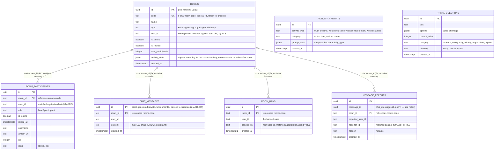

# ARCHITECTURE.md — Spintra System Architecture
> This document explains **why** the project is built the way it is, not just what exists.
> Update this document whenever a new pattern, folder, or architectural decision is introduced.
> Last updated: 2026-07-04

---

## 1. Tech Stack

| Layer | Technology | Version | Why |
|---|---|---|---|
| Framework | Next.js (App Router) | 16.2.9 | RSC for static pages, Client Components for realtime room; file-based routing |
| Language | TypeScript | ^5 | Strict type safety across the entire codebase |
| UI | React | 19.2.4 | Latest concurrent features; concurrent rendering helps with realtime updates |
| Realtime | Supabase Realtime | ^2.108.2 | Broadcast channels for game events; presence for participant tracking |
| Database | Supabase (PostgreSQL) | ^2.108.2 | Row Level Security, anonymous auth, real-time subscriptions |
| Styling | Tailwind CSS | ^4 | Utility-first; custom `glass` and `glass-card` classes in globals.css |
| Animation | Framer Motion | ^12.40.0 | `AnimatePresence`, `motion.div`, `useAnimation` for game transitions |
| 3D | Three.js + React Three Fiber | ^0.184 / ^9.6 | Physics-based lucky wheel rendering |
| Confetti | canvas-confetti | ^1.9.4 | Win celebrations; wrapped in `src/components/celebration.tsx` |
| QR Codes | qrcode | ^1.5 | Client-side room-invite QR generation in `room-header.tsx`, dynamically imported — replaced a third-party API call that sent every viewed room's URL (including private/locked ones) to an external service |
| UI Components | shadcn/ui (Radix-based) | various | Accessible primitives: Button, Dialog, Sheet, Badge, Input, ScrollArea, Tooltip, Avatar |
| Icons | lucide-react | ^1.21.0 | Consistent icon set |
| State (global) | Zustand | ^5.0.14 | Installed; not yet used in room. Available for future game state if needed. |
| E2E Tests | Playwright | ^1.40.0 | Smoke tests; config in `playwright.config.ts` |

---

## 2. Complete Folder Structure

```
spintra/
├── docs/
│   ├── START_HERE.md               ← Onboarding entry point — read this first
│   ├── INDEX.md                    ← Task-oriented doc routing guide
│   ├── AI_RULES.md                 ← Mandatory engineering constitution for every AI assistant
│   ├── AI_CONTEXT.md               ← Current project state only (update every session)
│   ├── HANDOFF.md                  ← Session continuity (last/current/next task, blockers)
│   ├── TASKS.md                    ← Backlog: High/Medium/Low priority, in progress, completed
│   ├── ARCHITECTURE.md             ← This file
│   ├── DECISIONS.md                ← Architecture Decision Records (ADRs)
│   ├── CHANGELOG_AI.md             ← Full chronological AI work log (append only)
│   ├── ENGINEERING_GOVERNANCE_REVIEW.md     ← Point-in-time audit, dated 2026-07-03 (historical)
│   ├── ENGINEERING_GOVERNANCE_REVIEW_V2.md  ← Current point-in-time audit, dated 2026-07-04
│   ├── ZUSTAND_INVESTIGATION.md    ← Zustand vs. Context state investigation report
│   ├── HOST_MIGRATION_AUDIT.md     ← Host-migration investigation report (all 14 games + infra)
│   ├── SPINTRA_CITY_SPEC.md        ← "Spintra City" engineering spec — START HERE for that feature
│   ├── SPINTRA_CITY_DESIGN.md      ← "Spintra City" feature: decisions, research, build plan
│   └── SPINTRA_CITY_CONTENT.md     ← "Spintra City" board content (spaces, economy, card decks)
├── src/
│   ├── app/
│   │   ├── globals.css             ← Global styles + glass/glass-card utilities
│   │   ├── layout.tsx              ← Root layout (ThemeProvider, Toaster)
│   │   ├── page.tsx                ← Home page
│   │   ├── create/                 ← Room creation flow
│   │   ├── explore/                ← Room discovery
│   │   ├── legal/
│   │   │   ├── terms/page.tsx      ← Terms of Service (static RSC)
│   │   │   └── privacy/page.tsx    ← Privacy Policy (static RSC)
│   │   ├── room/
│   │   │   ├── page.tsx            ← Room list page
│   │   │   └── [code]/
│   │   │       ├── page.tsx        ← Server component; passes `code` prop
│   │   │       ├── room-client.tsx ← Main client orchestrator (shell only — delegates to hooks/components)
│   │   │       ├── context/
│   │   │       │   └── room-activity-context.tsx  ← Shared context for activities
│   │   │       ├── hooks/
│   │   │       │   ├── use-room-chat.ts          ← Hook for chat, pagination, and text submissions
│   │   │       │   └── use-room-subscription.ts  ← Hook for Supabase Realtime, presence, and demo syncs
│   │   │       ├── components/
│   │   │       │   ├── room-header.tsx           ← Header details, connection status, lock/sound toggles
│   │   │       │   ├── room-sidebar.tsx          ← Chat box, reactions list, participant rows, and kick actions
│   │   │       │   └── close-room-dialog.tsx     ← Confirmation dialog for host closing the room
│   │   │       └── activities/
│   │   │           ├── activity-registry.ts       ← Plugin registry (game slug → dynamic import)
│   │   │           ├── activity-picker-dialog.tsx ← Host UI to switch games
│   │   │           ├── idle-screen.tsx            ← No-game state (single-game rooms)
│   │   │           ├── aggregate-idle-screen.tsx  ← No-game state (party rooms)
│   │   │           └── *-activity.tsx (×14)       ← One file per game, all migrated to the
│   │   │                                             zero-prop context-driven pattern (§3)
│   │   └── tools/
│   │       ├── bingo/              ← Standalone (non-room) tool page
│   │       ├── coin-flip/
│   │       ├── dice/
│   │       ├── guess-number/
│   │       ├── lucky-wheel/
│   │       ├── name-draw/
│   │       ├── never-have-i-ever/
│   │       ├── rps/
│   │       ├── team-maker/
│   │       ├── tournament/
│   │       ├── trivia/
│   │       ├── truth-or-dare/
│   │       ├── word-scramble/
│   │       └── would-you-rather/
│   ├── components/
│   │   ├── ui/                     ← shadcn/ui components (Button, Dialog, etc.)
│   │   ├── celebration.tsx         ← fireConfetti() wrapper
│   │   └── emoji.tsx               ← Emoji rendering, renderTextWithEmoji, EMOJI_UNICODE
│   └── lib/
│       ├── games.ts                ← GAMES array: GameDefinition[], 16 entries (14 real games + 2 create-only pseudo-types: party, classroom)
│       ├── types.ts                ← Shared TypeScript types (RoomType, ActivityEvent, User, etc.)
│       ├── utils.ts                ← cn(), shuffleArray<T>()
│       ├── room-user.ts            ← getOrCreateRoomUser(), getLocalRoomCreatorId()
│       ├── blocked-users.ts        ← localStorage-based per-viewer message block/mute
│       ├── chat-filter.ts          ← Basic profanity/spam content filter (client-side)
│       ├── audio.ts                ← Sound effects
│       └── supabase/
│           └── client.ts           ← getSupabaseBrowserClient() — returns null if no .env.local
├── supabase/
│   └── migrations/                 ← See §4's "Migrations Applied" table for the full,
│                                      current list (that table is the one docs:check
│                                      validates against the real files — this tree
│                                      intentionally doesn't duplicate it, since a
│                                      second hand-maintained list would drift silently)
├── tests/                          ← Playwright E2E tests
└── public/                         ← Static assets
```

---

## 3. Frontend Architecture

### Page Types
- **Static pages** (RSC by default): `/`, `/explore`, `/create`, `/legal/terms`, `/legal/privacy`, all `/tools/*` — these are server-rendered
- **Dynamic page** (fully client): `/room/[code]` — everything is client-side due to Supabase Realtime WebSocket

### Cookie/Consent Banner
`src/components/cookie-consent-banner.tsx` is a client component mounted globally inside `Providers` (`src/components/providers.tsx`), so it appears on every route. It shows once (gated on the `spintra-cookie-consent` localStorage key, following the `spintra-` key prefix convention in `room-user.ts`) and links to `/legal/privacy`. Uses the `queueMicrotask(() => setState(...))` pattern from `room-client.tsx`'s `hasMounted` effect to satisfy the `react-hooks/set-state-in-effect` lint rule.

### The Room Client Pattern

`room-client.tsx` serves as the clean client orchestrator. It has been modularized to separate state synchronization, user actions, and presentation elements into custom hooks and components:
- **Hooks:**
  - [useRoomSubscription](file:///c:/Users/tejas/Desktop/Spintra-1/src/app/room/[code]/hooks/use-room-subscription.ts): Isolated logic for Supabase Realtime channel lifecycle, Postgres changes subscriptions, presence states, and BroadcastChannel fallback event synchronization.
  - [useRoomChat](file:///c:/Users/tejas/Desktop/Spintra-1/src/app/room/[code]/hooks/use-room-chat.ts): Isolated logic for chat messages history loading, older messages pagination, and sending text or emoji responses.
- **Components:**
  - [RoomHeader](file:///c:/Users/tejas/Desktop/Spintra-1/src/app/room/[code]/components/room-header.tsx): Modular header element showing room title, badges, codes, active activity badges, and action buttons (copy link, locking, sounds toggles).
  - [RoomSidebar](file:///c:/Users/tejas/Desktop/Spintra-1/src/app/room/[code]/components/room-sidebar.tsx): Modular sidebar rendering the two-tabbed pane for Chat (messages container, reactions) and People list (participants, hosts crown, remove buttons).
  - [CloseRoomDialog](file:///c:/Users/tejas/Desktop/Spintra-1/src/app/room/[code]/components/close-room-dialog.tsx): Host-only modal dialog to confirm closing the room for everyone.
- **Does NOT own game state** — each activity owns its own local `useState`; migration to this pattern is complete for all 14 games.

### Activity Isolation Pattern

Each activity is a **self-contained plugin** following this contract:
```
1. Named export: export function XxxActivity()
2. Zero props
3. Reads shared state via: useRoomActivity()
4. Reads participants via: useRoomParticipants() [only if needed]
5. Owns all its game-specific state with local useState
6. Subscribes to events via: registerEventListener()
7. Sends events via: sendActivityEvent()
8. Cleans up: the return value of registerEventListener is returned from useEffect
9. Handles "activity_reset" event to clear its state
```

### Context Architecture

```
RoomActivityContext (STABLE — never re-renders subscribers)
├── roomCode: string
├── roomType: RoomType
├── isHost: boolean
├── hostUserId: string | null
├── currentUser: User
├── soundEnabled: boolean
├── sendActivityEvent: (event: ActivityEvent) => void
├── registerEventListener: (fn) => () => void
├── flushActivityState: () => Promise<void>
└── awardScore: (activityType, questionId?, choiceIndex?) => Promise<void>

RoomParticipantsContext (DYNAMIC — re-renders when participants list changes)
└── participants: RoomParticipant[]
```

**Why two contexts?** A single context triggers re-renders for all consumers when any value changes. Participants list changes frequently (joins/leaves). By isolating it in its own context, the 11 activities that don't need participants never re-render for that reason.

### Plugin Registry Pattern

```ts
// src/app/room/[code]/activities/activity-registry.ts
export const ACTIVITY_REGISTRY: Record<string, ComponentType> = {
  "coin-flip": dynamic(() => import("...").then(m => m.CoinFlipActivity), { ssr: false }),
  // ... 13 more
};
```

The registry is the **only** place that couples game types to components. `room-client.tsx` renders:
```tsx
const ActiveGame = ACTIVITY_REGISTRY[activeActivity.type];
<ActiveGame key={activeActivity.type} />
```

`key` forces remount on activity change, resetting all local game state cleanly.

### Pub/Sub Event Bus

Inside `room-client.tsx`:
```ts
// Publishers call:
sendActivityEvent({ kind: "coin_flip", result: "Heads" })
// → broadcasts to Supabase channel OR BroadcastChannel

// When events arrive from network:
handleActivityEvent(payload)
// → fans out to all listenersRef subscribers

// Activities subscribe:
useEffect(() => registerEventListener((event) => {
  if (event.kind === "coin_flip") { /* update local state */ }
}), [registerEventListener]);
// ← cleanup (deregister) is called automatically on unmount
```

**Since Session 41:** `registerEventListener` replays this activity's full persisted event log (`rooms.activity_state`, capped at 200 entries) to any listener the moment it registers — this is what lets a refresh/reconnect recover in-progress state (see §4's migration `0023`). A direct consequence: **an activity's listener-registration `useEffect` must keep a stable dependency array** — `[registerEventListener]`, optionally plus genuinely-stable values like `soundEnabled`/`currentUser.id` (every activity except one follows this). If a dependency changes as a *result* of handling a replayed event (e.g. a derived `useCallback` whose own deps include a state value the event handler sets), re-registering re-triggers the replay, which can re-fire that same terminal event and recreate the same state change — an infinite loop. This actually happened: Lucky Wheel's registration effect depended on `drawWheel`, a `useCallback` depending on `wheelSpinning` — every spin-start/spin-end transition changed `drawWheel`'s identity, re-registered the listener, replayed the still-present `wheel_spinning` event, and restarted the spin forever. Fixed by reading `wheelEntries`/`drawWheel` via refs inside the listener instead of depending on them for re-registration (`src/app/room/[code]/activities/lucky-wheel-activity.tsx`). Any new activity needing data that changes over the session should do the same — read a ref inside the callback, don't add it to the effect's dependency array.

---

## 4. Backend Architecture

### Supabase
- **No custom server** — all backend is Supabase (BaaS)
- **Database:** PostgreSQL with RLS on all tables
- **Auth:** Anonymous sign-in (`auth.signInAnonymously()`). Each browser session gets a unique UUID.
- **Realtime:** Broadcast + Presence channel per room (`room:{code}`), created with `{ config: { private: true } }` — authorized via RLS policies on `realtime.messages` (migration 0036), scoped by `is_member_of_room()`. **Sequencing requirement:** Realtime Authorization is evaluated once at `channel.subscribe()` time and cached for the connection's lifetime, so a client must not subscribe until its own `room_participants` row already exists — `use-room-subscription.ts` gates the subscribe effect on a `participantRowReady` flag set only after the participant upsert (`trackSelf`) completes, to avoid a client being denied and staying denied for the rest of its session. `postgres_changes` subscriptions on the same channel object (`chat_messages`/`room_participants`/`rooms` changes) are unaffected — that mechanism is governed entirely by table-level RLS, not `realtime.messages`.
- **Storage:** Not used

### Room Identification
- Rooms are identified by a 6-character `code` string (e.g. `3NJUZL`)
- The `code` is the primary key of the `rooms` table (not a UUID)
- `room_participants.room_id` references `rooms.code` (text FK)

### RLS Summary
- Users can only read/write their own data
- Hosts can update any participant row in their room (migration 0007)
- Hosts can update room metadata for their own rooms
- All inserts verified against `auth.uid()`
- Room creation and chat messages are additionally rate-limited by before-insert triggers keyed on `auth.uid()` (migration 0011) — 8 rooms / 10 min, 20 messages / 10 sec
- Kicking a participant (host-only) also records a `room_bans` row; a before-insert trigger on `room_participants` rejects any rejoin attempt from a banned `user_id` (migration 0012)
- Any participant can flag a chat message via `message_reports` (insert-only — no select policy; reviewed by the project owner directly via the Supabase SQL editor, since there's no admin backend)

### Migrations Applied
| # | File | Purpose |
|---|---|---|
| 0001 | `init_schema_and_rls` | Base schema (`rooms`, `room_participants`, `chat_messages`) + initial RLS |
| 0002 | `room_close_cascade` | Cascade-delete participants/messages when a room closes |
| 0003 | `disable_rls_for_realtime_delete` | Disabled RLS on `rooms`/`room_participants` to fix two realtime-delete bugs (see file header) |
| 0004 | `add_foreign_keys_and_composite_indexes` | Real FK constraints (`room_id` → `rooms.code`, cascade), composite indexes for chat/participant queries |
| 0005 | `enable_anonymous_auth_rls` | Re-enabled RLS, scoped to `auth.uid()` now that anonymous auth exists |
| 0006 | `allow_host_promotion_update` | Lets a participant self-promote to host if the current host is offline/left |
| 0007 | `allow_host_update_participants` | Lets the host update other participants' rows (e.g. marking a crashed client offline) |
| 0008 | `create_activity_prompts` | Creates + seeds `activity_prompts` (Truth or Dare / Would You Rather / Never Have I Ever) |
| 0009 | `backend_and_db_improvements` | Security definer membership helper, hardened RLS policies, check limits trigger, and cleanup function |
| 0010 | `create_trivia_and_scramble_prompts` | Creates `trivia_questions` table, seeds trivia questions, and seeds Word Scramble words |
| 0011 | `rate_limiting` | Before-insert triggers capping room creation (8 / 10 min per `host_id`) and chat messages (20 / 10 sec per `user_id`); supporting composite indexes |
| 0012 | `moderation_controls` | `room_bans` table + before-insert trigger blocking a banned `user_id` from rejoining a room (kick now also bans); `message_reports` table (insert-only, no select policy — reviewed via Supabase SQL editor) |
| 0013 | `room_bans_self_select` | Adds a self-scoped select policy to `room_bans` (`user_id = auth.uid()::text`) so a client can check whether *it* is banned before the room UI mounts, instead of only finding out via the before-insert trigger's error after the fact |
| 0014 | `tighten_rls_column_restrictions` | BEFORE UPDATE triggers restricting the `rooms` host-promotion escape hatch (0006) and the `room_participants` host-update policy (0007) to only the single column each was meant for |
| 0015 | `enforce_room_lock_at_db_level` | Before-insert triggers on `room_participants` and `chat_messages` blocking new joins/messages from anyone but the host while `rooms.is_locked` — previously client-side only |
| 0016 | `add_missing_constraints_and_index` | `rooms.max_participants > 0` check, `message_reports.message_id` FK to `chat_messages`, `trivia_questions.correct_index` bounds check, index on `activity_prompts.activity_type` |
| 0017 | `drop_unused_rooms_settings_column` | Drops `rooms.settings` (always `{}`, never read anywhere) |
| 0018 | `message_reports_host_visibility` | Adds `reviewed` flag + a select/update policy scoped to the room's host (column-restricted to `reviewed` only, via trigger) so reports are actually visible in the app |
| 0019 | `presence_reconciliation_any_participant` | Lets any participant flip another's `is_online` true→false (never true, never other columns) — previously only the host could, which meant a crashed host's own stale row could never be corrected by anyone, permanently blocking host succession |
| 0020 | `schedule_room_cleanup_cron` | Enables `pg_cron` and schedules `public.cleanup_inactive_rooms()` (defined in 0009) to run every 30 minutes, closing the gap where that function existed but was never actually scheduled |
| 0021 | `drop_unused_spectator_role` | Tightens `room_participants_role_check` to `('host', 'participant')` — `'spectator'` was dead at the DB level since the client-side `UserRole.spectator` enum was removed in Session 38 |
| 0022 | `add_public_rooms_index` | Partial index on `rooms (is_public, created_at desc) where is_public = true`, supporting the Explore page's actual query pattern as room count grows |
| 0023 | `add_room_activity_state` | Adds `rooms.activity_state jsonb` — a capped, ordered log of the current activity's events, letting a refreshing/reconnecting client replay and recover in-progress game state instead of starting blank |
| 0024 | `fix_participants_update_recursion` | Fixes a live "infinite recursion detected in policy for relation room_participants" 500 error — migration 0019's `participants_update` policy directly self-referenced `room_participants` instead of using the safe `is_member_of_room()` security-definer helper; this broke every reconnect, presence sync, and host-election update until fixed |
| 0025 | `room_join_rate_limit` | Before-insert rate-limit trigger on `room_participants` (20 joins / 10 min per `user_id`) — closes the gap where new room joins were the only major write path with no throttling, which could otherwise be used to game Explore's participant-count-based Trending/Popular ranking |
| 0026 | `fix_capacity_check_online_only` | Fixes `check_room_limit_before_join()` to count only `is_online = true` participants — a disconnected participant's row is kept, not deleted, so counting every row regardless of status made a room's effective capacity shrink permanently every time someone joined and left. Client-side capacity pre-checks (home page, explore page, navbar quick-join, room-client.tsx) fixed the same way in the same session |
| 0027 | `fix_host_promotion_trigger_stale_settings_column` | Fixes a live "record \"new\" has no field \"settings\"" error on every self-promotion host election — migration 0014's `restrict_host_promotion_update()` trigger compared `new.settings`/`old.settings`, but migration 0017 (which ran after) dropped `rooms.settings` entirely and never updated this function. Recreated with the stale column comparison removed |
| 0028 | `guess_number_server_side_secret` | Moves Guess-the-Number's secret and win-check server-side: new `guess_number_secrets` table with no direct SELECT/INSERT/UPDATE policies at all, and two SECURITY DEFINER RPCs (`set_guess_number_secret`, host-only; `check_guess_number`, room-members-only, returns just the hint) — fixes the secret being broadcast in plaintext to every client and each guesser's own client self-reporting an unverified "hint" |
| 0029 | `fix_room_join_toctou_race` | Closes a TOCTOU race in `check_room_limit_before_join()`: under READ COMMITTED, two concurrent joins to the same room could each see room for the last slot before either committed, letting a room exceed `max_participants`. Adds `pg_advisory_xact_lock(hashtextextended(new.room_id, 0))` at the top of the trigger, serializing joins racing on the *same* room (different rooms remain fully concurrent). Verified live: 10 concurrent join attempts for a room's single remaining slot — exactly 1 succeeded, 9 correctly rejected |
| 0030 | `message_report_rate_limit` | Before-insert rate-limit trigger on `message_reports` (10 reports / 10 min per `reporter_id`, same pattern as 0011/0025) — the pre-existing `unique (message_id, reporter_id)` constraint only stopped re-reporting the same message, not rapid-fire reporting many different messages. Verified live: 11 reports of 11 distinct messages, exactly 10 succeeded |
| 0031 | `grant_table_privileges` | Explicit `GRANT SELECT/INSERT/UPDATE/DELETE ... TO anon, authenticated` (plus matching `ALTER DEFAULT PRIVILEGES` for future tables) on every `public` schema table. Found via CI: a freshly-reset local/CI instance running only this repo's migrations rejected every write with "permission denied for table rooms" (42501) — the live hosted project has never hit this because Supabase's platform applies these grants automatically when a project is created via the dashboard, outside of and never captured in this repo's migration history. RLS remains the actual security boundary; this only lets Postgres evaluate those policies at all |
| 0032 | `moderation_event_observability` | Adds `log_moderation_event()`, called from all 5 rate-limit/ban-rejection triggers (room creation, chat, room joins, message reports, banned-rejoin) right before their `raise exception`. Uses `raise log` (Postgres server log, searchable via Supabase Dashboard → Logs → Postgres Logs, filter `MODERATION_EVENT`) rather than a table write — a table-based first attempt at this was verified live to log **zero rows, ever**, because `raise exception` rolls back the entire transaction, including a table INSERT made moments earlier in the same trigger; `raise log` is not a data change and survives exactly that rollback. Caught and corrected before ever being committed |
| 0033 | `guess_number_rate_limit` | Adds a call-frequency limit to `check_guess_number` (15 guesses / 60 sec per room+user, via a new `guess_number_attempts` table) — migration 0028 moved the secret server-side but didn't rate-limit the RPC itself, letting a scripted client binary-search the 1-100 secret in ~7 rapid calls. Verified live: exactly 15 guesses succeeded, the 16th was rejected |
| 0034 | `bound_text_column_lengths` | Adds `char_length()` CHECK constraints to previously-unbounded text columns: `rooms.name` (≤200), `room_participants.username`/`avatar_url` (≤100/≤2048), `message_reports.reason` (≤500) — generously above the client's own input limits, so no existing data was affected |
| 0035 | `activity_state_participant_only` | Moves `activity_state` from the world-readable `rooms` table into a new `room_activity_state` table with participant-scoped RLS (only room participants can SELECT/INSERT/UPDATE). In-progress game data (trivia answers, confessions, votes, etc.) was previously readable by any authenticated user via the existing `rooms for select using (true)` policy. |
| 0036 | `realtime_broadcast_presence_authorization` | Enables Supabase Realtime Authorization (RLS on `realtime.messages`) for the `room:{code}` Broadcast/Presence channel, scoped by the existing `is_member_of_room()` helper. Closes a gap where Broadcast/Presence had no authorization at all — any anonymous session could subscribe to any room's channel (including private rooms) with no trace, and a banned/kicked user kept full realtime access since the ban trigger only blocked `room_participants` inserts, never the channel. See §4's Realtime section for the client-side sequencing requirement this introduces. |
| 0037 | `message_reports_consistency_check` | Tightens `message_reports`' insert policy to also require room membership (`is_member_of_room()`) and that `message_id`/`room_id`/`reported_user_id` are mutually consistent with the real `chat_messages` row — previously a crafted client could file a syntactically valid report against a real message but falsely attribute it to an arbitrary `reported_user_id`, surfacing as if legitimate in the host-facing reports panel. |
| 0038 | `room_participants_update_rate_limit` | Adds a before-update rate limit on `room_participants` (30 updates / 60s per acting `auth.uid()` per room, new `room_participants_update_attempts` table) — the one major write path with no throttling; a client could otherwise spam `.update({ username })` on its own row at unlimited frequency, flooding every subscriber's realtime feed. Scoped generously so reconnects, host-election, and presence-reconciliation writes are unaffected. |
| 0039 | `bound_remaining_columns_and_activity_state_size` | Adds three previously-missing bounds: `room_activity_state.activity_state` server-side size CHECK (<100KB, the 200-event cap was client-side only), `rooms.code` length CHECK (1–12 chars, despite being the FK target for 5 other tables), and `rooms.type` enum CHECK (the 16 known `RoomType` values — client-validated only before this). |
| 0040 | `chat_messages_username_snapshot` | Adds a nullable `username` column to `chat_messages`, captured at send time (with a best-effort backfill against `room_participants` for existing rows) — previously any chat message from someone other than the current viewer always displayed as "Guest", even mid-session, since nothing captured or fetched a username at all. |
| 0041 | `analytics_events` | First-party analytics event log (`room_created`, `room_joined`, `activity_started` only — no third-party tool, matching the cookie banner's promise). Insert-only RLS (`actor_id = auth.uid()`), no select policy (internal data, not shown to any user), rate-limited (100 events/10min per actor, same pattern as migration 0038). |
| 0042 | `capacity_check_excludes_own_row` | Fixes `check_room_limit_before_join()` (0009/0026/0029) to exclude the joining user's own row from the online-participant count — the `before insert` trigger previously fired on every upsert attempt including one resolving to an update of the caller's own existing row, so a redundant/duplicate join upsert for an already-online user could see the room "at capacity" (counting themselves) and reject its own harmless upsert. Found live via React Strict Mode's dev-only double-effect-invocation reproducing it reliably; the same flaw could also misfire in production on a fast-reconnect race. A genuinely new participant is still correctly blocked once the room is truly full. |
| 0043 | `room_bans_unban_support` | Adds a host-scoped select policy (0013 only let a user see their *own* ban row, never the room's list) and a host-scoped delete policy (none existed) to `room_bans`, a nullable `username` snapshot column (captured at insert time, best-effort backfilled), and adds `room_bans` to the `supabase_realtime` publication (it was never added, unlike `message_reports` in 0018 — found live: the new unban panel's `postgres_changes` subscription silently never fired a single event without this). Closes the Session 45-deferred "no unban path" gap. |
| 0044 | `denormalize_participant_count` | Adds `participant_count` column to the `rooms` table, kept in sync via triggers on `room_participants` INSERT/UPDATE/DELETE. Optimizes the Explore page queries and completely removes the need for table-wide wildcard subscriptions. |
| 0045 | `secure_trivia_answers` | Revokes SELECT privileges on `trivia_questions(correct_index)` from standard roles (`anon`, `authenticated`), and adds secure backend RPC `verify_trivia_answer()` to check answers without exposing the key in queries. |
| 0046 | `atomic_host_election` | Creates database RPC `elect_room_host()` to update both the participant role and the room host reference in a single atomic database transaction, preventing client-side split-brain states. |
| 0047 | `fingerprint_and_ip_bans` | Adds `fingerprint_hash` column to `room_participants` and `room_bans`. The ban-check trigger now blocks rejoins matching either `user_id` or `fingerprint_hash`, preventing anonymous token rotation from bypassing bans. The client supplies `fingerprint_hash` directly on ban insert (kick deletes the participant row first, so a trigger-side lookup alone can't find it); the before-insert trigger on `room_bans` only falls back to its own lookup if the client didn't already provide one. |
| 0048 | `bingo_card_schema` | Adds `bingo_card` jsonb column to `room_participants` so clients can persist their generated Bingo card grids to the database, enabling host-side verification of win claims against the called numbers. |
| 0049 | `room_max_participants_bounds` | Replaces `rooms.max_participants > 0` (0016) with a full `2 ≤ max_participants ≤ 50` CHECK, making the DB the single authoritative source for the capacity ceiling that the creation slider, the new Room Settings Panel (ADR-007), and any raw API call all inherit — previously the 50 ceiling was enforced only in the browser, so a crafted request could set any positive value. Clamps any pre-existing out-of-range rows into `[2, 50]` before adding the constraint. |
| 0050 | `room_scores_and_xp_awards` | Adds `room_scores` (an append-only, participant-readable ledger; host-only reset delete; added to the realtime publication) and the `award_score()` SECURITY DEFINER RPC (ADR-008/009) — server-verifies each win/participation claim by reading persisted state directly (never a client-supplied claim), for Trivia (re-checks `trivia_questions.correct_index`), RPS (re-derives the round's winner from persisted `rps_choice` events), and Bingo (re-checks the caller's persisted `bingo_card` against persisted `bingo_call` events, then fans out participation credit to other online participants). Idempotent via a unique constraint on `(room_id, user_id, activity_type, round_key, award_kind)`, where `round_key` is always RPC-derived (never client-supplied) from event-log position. Atomically writes `room_participants.xp`/`rank` in the same transaction via `tier_for_xp()` (mirrors `lib/xp.ts`'s `tierOf()`). Also adds a session-local bypass flag to `check_room_participants_update_rate_limit()` (0038) and `restrict_host_participant_update()` (0014) so this RPC's server-verified writes — including crediting *other* participants' XP for Bingo's fan-out — aren't blocked by the client-abuse protections those triggers exist for. |
| 0051 | `fix_participant_restriction_regression` | Fixes a security regression introduced by migration 0050: `restrict_host_participant_update()` (0050's copy) was written from an outdated version of the function, silently dropping the host/non-host distinction and true→false-only direction check that migration 0019 added — live in production between 0050 and 0051, any participant could flip any other participant's `is_online` in either direction, not just the host, and not just in the safe direction. Found in code review (PR #20) before merge; restores 0019's exact behavior with 0050's server-verified-write bypass flag layered on top of it, not in place of it. |
| 0052 | `award_score_review_fixes` | Code-review fixes for migration 0050's `award_score()` (PR #20, none security-critical — the one that was, is 0051): folds the trivia question's sequence number into `round_key` so a legitimately re-drawn question (shuffle-bag exhaustion) doesn't collide with its earlier occurrence and silently earn nothing; extracts the insert-with-conflict + XP-update pattern (previously copy-pasted 4×) into an internal `_record_award()` helper, explicitly `revoke`d from `public` (Postgres grants EXECUTE to PUBLIC by default on function creation — an unrevoked helper would have been directly callable by any client, bypassing every verification `award_score` performs, confirmed live during this migration's own testing); reuses `is_member_of_room()` in `room_scores`' SELECT policy instead of a hand-rolled duplicate; combines the RPS/Bingo branches' two redundant event-log scans into one; corrects a comment that inaccurately implied `elect_room_host` (0046) uses an equivalent bypass mechanism (it doesn't — 0050 is the first place this pattern appears). Drops and recreates `award_score` with a new `p_question_num` parameter (a true signature change, not just `create or replace`, to avoid leaving a stale 4-parameter overload live). |
| 0053 | `moderation_actions` | Adds `moderation_actions` (ADR-010) — an append-only audit log for the Moderation Dashboard's History tab, written at the 3 host-action call sites (dismiss report, kick+ban, unban). Host-scoped SELECT and INSERT RLS (matching `message_reports_select_host`/`room_bans_select_host`'s exact pattern) — simpler than `award_score` (0050), since a host's own moderation action doesn't need adversarial server-side re-verification the way a participant's self-reported game win does. Added to the `supabase_realtime` publication in this same migration (the repeated lesson from 0043 and 0050/0051: never assume, always verify). |
| 0054 | `message_reports_reporter_username` | Adds a nullable `reporter_username` snapshot column to `message_reports`, captured client-side at report time (same pattern as `chat_messages.username`, migration 0040), so the Moderation Dashboard's Reports tab can render "X reported a message from Y" without a live join — the reported side is already recoverable via the existing `chat_messages(username)` embed. Best-effort backfilled from `room_participants` for pre-existing rows. |
| 0055 | `moderation_rpc` | Replaces the client-orchestrated multi-step moderation flows with three transactional `SECURITY DEFINER` functions — `moderation_kick_ban`, `moderation_unban`, `moderation_dismiss_report` — each of which re-verifies the caller is the room's *current* host and (for kick) rejects self-targeting, then performs every step of the verb atomically (kick & ban: snapshot → participant delete → ban insert-or-noop → close all open reports about the target → audit-log row). Motivated by three real bugs from the client-side version in one week: an RLS-rejected `room_bans` upsert, reports outliving a kick, and a promoted host able to kick & ban themself from a stale report. Table RLS policies are unchanged; execute is granted to `authenticated` only. Client callers live in `src/lib/moderation.ts`. |
| 0056 | `elect_room_host_demotes_stale_host` | `elect_room_host` (0046) promoted the new host but left the dead host's `room_participants` row at `role='host'`, producing a permanent second "Host" entry in the People list and — if the ex-host ever rejoined — a stale online `role='host'` row that blocked every future election. Now the election demotes every other `role='host'` row in the room in the same transaction. The demotion is a cross-row role change that `trg_restrict_host_participant_update` (0014) forbids (triggers still fire for `SECURITY DEFINER` functions even though RLS doesn't), so the trigger gains a transaction-local `app.electing_room_host` GUC escape hatch set only inside `elect_room_host` — the same pattern `award_score`'s `app.bypass_participant_rate_limit` established (0050/0052). Client counterpart (same session, no migration): a one-shot settle pass ~10s after subscribing reconciles the DB's `is_online=true` rows against live presence, fixing rooms whose host crashed *before* the joiner arrived — the presence-sync handler could only ever catch peers who crash while being watched, so such rooms were stuck at "Waiting for host…" forever. |
| 0057 | `guess_number_get_secret` | Adds `get_guess_number_secret`, letting a host recover the secret number after a refresh — critically, after a host migration (see `docs/HOST_MIGRATION_AUDIT.md` finding C1), since the secret otherwise only ever lived in the *original* host's local React state and a newly-promoted host had no way to see it. **Host-migration audit correction (2026-07-14):** this migration's own SQL had a dollar-quoting bug (`as $body` / `$body;` instead of `$body$` / `$body$;`) that made every prior apply attempt fail with a syntax error — it was tracked as applied while never actually running, confirmed live via `pg_proc`. Fixed and re-applied; verified end-to-end with a real host session (returns the secret) and a real non-host session (rejected). |
| 0058 | `fix_host_trigger_regression` | Restores `restrict_host_participant_update`'s host/participant branching logic (0051) that 0056 had accidentally overwritten while adding its own bypass — confirmed genuinely live via `pg_proc`. |
| 0059 | `tournament_fixes` | Widens the `room_activity_state` size check from 100KB to 500KB so a 50-player Round Robin (1,225 matches) doesn't exceed it. **Host-migration audit correction (2026-07-14):** the original SQL targeted `public.rooms.activity_state`, a column migration 0035 had already dropped 24 migrations earlier (moved to `public.room_activity_state`) — it failed with "column does not exist" on every apply attempt and was tracked as applied while never running. Retargeted to the correct table; verified live by upserting a 309KB payload (would have failed the old 100KB cap on the correct table, succeeds under the new 500KB one). |
| 0060 | `tournament_state_host_only` | Closes `docs/HOST_MIGRATION_AUDIT.md` finding H1: unlike RPS/Bingo/Trivia, Tournament's scoring has no server-verified backstop (`award_score`) — any room member could persist a forged `tournament_update` (declare themselves champion, corrupt the bracket) via `room_activity_state`'s deliberately open write policy (0035). Adds a `before insert or update` trigger that requires the live `auth.uid() = rooms.host_id` specifically when the persisted payload's `type = 'tournament'` — every other activity type, and clearing state entirely (switching games), is untouched. Narrow by design (inspects only the JSON `type` discriminator, doesn't modify any other function), unlike this session's earlier 0056 regression. Paired with a client-side check in `tournament-activity.tsx` (a self-reported `senderId` on `tournament_update` events, checked against each client's own live-synced host id) that dampens the live-broadcast race during an actual transition — not a security boundary itself (a client could lie about `senderId`), that's this trigger's job. Verified live: non-host forged write rejected, legitimate host write succeeds, non-tournament activity writes and state-clearing remain open to any participant as before. |
| 0061 | `elect_room_host_idempotent` | Found via a live two-participant repro: the promoted client saw "You are now the host." three times, and the other client's screen showed a *different* user as host entirely. Two bugs in `elect_room_host` (0046/0056): (1) no idempotency guard — once a caller was already host, the "is there another online host" check found none and fell through to redundantly re-run the promotion, returning `true` again every time (5 separate client call sites in `use-room-subscription.ts` can each independently trigger this in the same tick, each re-firing the toast/notification/broadcast); (2) no concurrency control — two clients calling it for the same room at nearly the same moment could interleave (both read "no online host" before either commits, both promote themselves, neither's demote step touches the other), producing a genuine split-brain with two `role='host'` rows and `rooms.host_id` landing on whichever committed last. Fixed with a transaction-scoped `pg_advisory_xact_lock(hashtext(p_room_code))` acquired first (serializes concurrent callers for the same room — a second caller blocks until the first commits, then correctly no-ops via the new "already host" check) plus the idempotency check itself. Verified live via `pg_proc`. |
| 0062 | `rooms_select_privacy_fix` | Found while investigating the Explore page's public-room display: `rooms_select` (0005) has been `using (true)` since anonymous auth was introduced and was never tightened when `room_participants`/`chat_messages` were hardened in 0009 (that migration's own follow-up comment, carried into 0035, explicitly notes this was still true and left unaddressed). Any anon-key holder — the key ships in every page load, not a secret — could list every room ever created via a direct REST call, private ones included: `code`, `name`, `type`, `host_id`, `is_locked`. Since a room's `code` is the actual join credential ("Off = invite-only via code" per the create-room UI), this fully defeated privacy for any private, unlocked room — no invite needed, codes were directly enumerable. Fixed in two parts: (1) tightened `rooms_select` to the same `is_public OR host OR is_member_of_room` pattern 0009 already established; (2) RLS decides row visibility from the requester's identity alone, so it can't distinguish "already knew this exact code" from "enumerated every row" — a policy tight enough to stop enumeration would also block a legitimate invited friend from looking up the one room they have a real code for. Added `get_room_by_code(p_code text)`, a `security definer` RPC matching the existing `is_member_of_room`/`elect_room_host` pattern: takes exactly one code, returns at most one row (code is `unique`), so enumeration stays impossible through it. All 6 client call sites that look up a room by code pre-membership (join-check, room-page entry, create-room's collision check, host-migration/kicked-vs-closed check) now go through this RPC via a new `src/lib/room-lookup.ts` helper instead of a raw `.from("rooms").select()`. Verified against a local Docker Supabase reset before ever touching production: reproduced the exposure locally first (confirmed empty after the fix, including against a freshly-minted real anonymous session, not just an unauthenticated API-key request); confirmed a genuine room member still sees their room via a normal `SELECT` once actually joined; full Playwright suite (63/63) green against the local instance, covering create+join, two-participant join, reconnect, host-kick, and live settings sync. |
| 0063 | `spintra_city_match_engine_lobby` | **Slice 1 of the Spintra City feature (see `docs/SPINTRA_CITY_SPEC.md`) — lobby only: create a match, take a seat, ready up, start. No board, dice, money, or trading yet.** Adds `'city'` to `rooms_type_check` (without this, room creation fails at the DB layer no matter what the TypeScript union says), plus `city_matches`, `city_match_players`, and the `city_command_attempts` rate-limit ledger. Departs deliberately from the other 14 activities: no `room_activity_state` event-log replay — Postgres is the referee, and clients call `SECURITY DEFINER` commands (`city_create_match`, `city_join_seat`, `city_leave_seat`, `city_set_ready`, `city_start_match`) that derive identity from `auth.uid()` (0052's convention, not 0046's weaker parameter-passing one), take a per-match `pg_advisory_xact_lock` (0029's convention), and rate-limit through a shared gate (0011/0025/0030/0033/0038's convention). Randomness is **derived** from `(rng_seed, rng_counter)` rather than stored as a precomputed outcome sequence, so nothing sits in a row waiting to leak and a match replays exactly from one value; both columns are withheld from clients via the same column-allowlist mechanism 0045 uses for trivia's answer key, and an explicit test seed is accepted only for `auth.role() = 'service_role'` so a browser client can never pick a seed whose outcomes it precomputed. A partial unique index enforces at most one non-terminal match per room at the storage layer rather than in application code. Also guards a real hazard found while specifying this: every sibling table cascades from `rooms`, and Close Room hard-deletes that row (`use-room-subscription.ts`), so following convention alone would let one host click erase a live match — the cascade is kept (no orphans, normal backup/cleanup behaviour) and a `before delete` trigger blocks the *accidental* path unless a caller opts in via the transaction-local `app.force_close_room` flag. `cleanup_inactive_rooms()` was rewritten accordingly: it sets that flag (otherwise one guarded room would raise and roll back the sweep for every room) and gives City rooms a 24h inactivity threshold instead of the standard 2h, since a match represents far more player investment and a fully-disconnected match is specified to pause durably rather than be destroyed. |
| 0064 | `spintra_city_board_and_dice` | **Slice 2 of Spintra City — the board, server-authoritative dice, movement, and the turn cycle.** Adds `city_board_spaces` (the 40 spaces with their prices and rents, seeded from `docs/SPINTRA_CITY_CONTENT.md`) and `city_assets` (per-match ownership). Prices and rents live in Postgres rather than the client bundle for the same reason the trivia answer key does: rent is money, and a client that can redefine the rent table can rewrite the economy. The board is world-readable — it is *authorship* that must stay server-side, not confidentiality. Dice come from `city_derive_dice(seed, counter)`, a pure function over 0063's `(rng_seed, rng_counter)`, so a match replays exactly from one value and a test can pin outcomes; two bytes per die keeps modulo bias at ~0.006%. `city_roll_dice` and `city_end_turn` follow the established command shape (identity from `auth.uid()`, per-match `pg_advisory_xact_lock`, shared rate-limit gate) and implement the Departure salary, the three-doubles trip to Customs, and the doubles re-roll. Adds the pausable turn-clock columns (`turn_clock_elapsed_ms`, `turn_clock_paused_at`, `pace_seconds`) that `DESIGN.md` §3's clock model needs. Redefines `city_start_match` to grant the 1,600-Spin starting stake at match start: 0063 left every seat on zero, which was correct while there was no economy, but Slice 2 pays a salary and Slice 3 charges rent, so an unfunded economy would bankrupt everyone on first contact. Granted at *start* rather than at seat time so leaving and retaking a lobby seat cannot mint money. |
| 0065 | `spintra_city_buy_rent_bankruptcy` | **Slice 3 of Spintra City — buying, rent, tax, insolvency and bankruptcy** (FR-11, FR-12, FR-18). Adds `city_rent_for` (one definition of rent that buy, landing and bankruptcy all agree on: base rent doubled for a complete undeveloped country, the tier table once developed, 30/60/120/240 for airports by count held, 5x/12x the dice for utilities, and nothing at all when mortgaged), `city_bankrupt_seat` (§3.1D's single sequence — cash and properties transfer to the creditor keeping mortgage status, or return to the bank unowned; the seat is marked bankrupt and the match finishes when one player remains), and `city_resolve_landing`. **Landing resolution runs inside `city_roll_dice`'s own transaction, not as a second RPC** — if paying rent required a follow-up call, a client could simply never make it. `city_buy_property` re-checks ownership and funds inside the advisory lock rather than trusting the phase, and `city_end_turn` now refuses while a required decision is outstanding. Both `city_resolve_landing` and `city_bankrupt_seat` are revoked from clients entirely: they are steps the engine takes, never actions a player invokes. Knowingly incomplete against FR-11: declining leaves the property unowned instead of opening an auction, because auctions are Slice 6 — recorded in the migration rather than silently skipped. Insolvency goes straight to bankruptcy for the same honest reason: mortgaging and selling arrive in Slice 4, so maximum liquidation is currently zero, which is exactly what §3.1D says to do when liquidation cannot cover the debt. |
| 0066 | `spintra_city_build_mortgage_liquidation` | **Slice 4 of Spintra City — development tiers, mortgaging, and real liquidation** (FR-13, FR-14, and the half of FR-18 Slice 3 could not honour). Adds `city_build` / `city_sell_building` (complete-country requirement, even-build enforced in both directions — only the lowest tier may be raised and only the highest lowered), `city_mortgage` / `city_unmortgage` (half list price out, that plus 10% to lift, buildings stripped first), `city_max_liquidation`, and `city_declare_bankruptcy`. **The behavioural change is to insolvency.** Slice 3 sent an unpayable debt straight to bankruptcy, which was correct while nothing could be sold — maximum liquidation was genuinely zero. Now `city_resolve_landing` compares the debt against cash plus maximum liquidation: if it is survivable the seat gets `pending_debt` and a raise-funds window instead of being eliminated, and if it is not, bankruptcy is still declared immediately rather than forcing a ritual that cannot succeed (DESIGN.md §3.1D). A pending debt blocks rolling and ending the turn the same way a pending purchase does, `city_try_settle_debt` runs after every liquidation step so a player who has raised the money cannot sit in the phase, and `city_declare_bankruptcy` refuses with `CITY_CAN_PAY` while the player could still cover it — otherwise conceding would be a way to deny a creditor their rent. `city_assert_can_manage` is dropped and recreated rather than replaced, because an earlier shape used OUT parameters and CREATE OR REPLACE cannot change a return type. |
| 0067 | `spintra_city_trading` | **Slice 5 of Spintra City — trading between players** (FR-20…FR-24, DESIGN.md §3.1F). Adds `city_trade_offers` and `city_propose_trade` / `city_accept_trade` / `city_resolve_trade`. Trading is the stated core value of this mode and also the easiest place to corrupt an economy, because an offer describes a world that may no longer exist when somebody clicks accept. The governing rule is therefore **never trust the stored offer row**: every referenced space's ownership and development, plus both parties' cash and seat status, are re-derived inside the same locked transaction that would apply the trade, and a mismatch raises `CITY_OFFER_STALE` rather than executing terms that no longer hold. FR-22's atomicity is a property of that single transaction rather than something the function has to be careful about. A city cannot change hands while anything in its *country* carries buildings — moving one out of a developed set would leave it both broken and over-built, which no later command could repair. Offers lapse at the end of the proposer's next turn (hence the new `city_matches.turn_number`) or after three minutes, whichever comes first; accepting an offer also closes every other pending offer naming a space that just moved, which is §3.1F's "superseded" marking — cosmetic for correctness, since accept re-validates regardless, but it stops the UI presenting offers guaranteed to fail. `city_bankrupt_seat` was extended to close a bankrupt seat's pending offers for the same reason. Proposing is blocked while the proposer owes a pending debt, so a trade cannot be used to stall inside the raise-funds window. |
| 0068 | `spintra_city_cards_and_detention` | **Slice 6a of Spintra City — both card decks and detention** (FR-15, FR-19). Auctions are the other half of Slice 6. These ship together because they are coupled: the Transit Visa is a card, and it is the only free way out of Customs. Adds `city_cards` (all 32 cards seeded from `CONTENT.md` §6–7, effect stored as a small tagged union rather than a wide mostly-null table) plus `city_draw_card`, `city_apply_card`, `city_leave_detention`, and the `in_detention` / `detention_turns` / `transit_visas` seat columns. A deck is a **permutation, not a bag**: the order is derived by hashing (seed, deck, round, card id) so one seed still reproduces an entire match, `draw` walks that order, and the round increments when it wraps — which is FR-19's reshuffle. A held Transit Visa is excluded from its deck while held. Movement cards deliberately fall through to `city_resolve_landing` instead of reimplementing rent and purchase, so a card that sends you to Dubai behaves exactly as the dice would; moving *backwards* across Departure pays no salary. Also extracts `city_charge` as the single path by which rent, tax and card penalties take money, because all three must offer the raise-funds window rather than silently overdrawing — previously that logic existed only inside `city_resolve_landing` and a card penalty would have bypassed it. Detention offers the three exits from `CONTENT.md` §5 (pay 90, spend a visa, roll doubles) and the third failed attempt pays the fee whether the player likes it or not, which is `DESIGN.md` §3.1A's deliberate exception to "a timeout never auto-spends". |
| 0069 | `spintra_city_auctions` | **Slice 6b of Spintra City — auctions** (FR-17, DESIGN.md §3.1E), closing the gap Slice 3 opened knowingly when declining a property left it unowned. Adds `city_auctions` plus `city_place_bid` / `city_pass_auction` / `city_settle_auction`, and rewrites `city_decline_purchase` to open one. **Timing without a scheduler:** an auction carries a deadline, and any client that sees it pass may call `city_settle_auction`, which re-derives whether the deadline has actually passed rather than trusting the caller — the same shape the turn clock is specified with, so there is no cron job and a lying client is simply refused. Implements §3.1E in full: a 10-Spin floor and increment, a 10-second reset on every bid so an auction cannot be sniped, a hard two-minute ceiling the reset can never push past, non-binding passes (bidding removes you from the passed set), and no bidding on credit checked against live cash. All-but-the-high-bidder passing settles immediately rather than waiting out the clock. Two outcomes deserve naming: with fewer than two eligible bidders no auction opens at all and the space stays unowned, and a winner whose cash fell below their bid while the auction ran — a rent charge landing mid-auction, say — wins nothing, because the settle re-checks affordability rather than trusting the standing bid. A running auction blocks ending the turn, and pauses the active player's turn clock since none of the delay is their fault. |
| 0070 | `spintra_city_match_end_and_scoring` | **Slice 7 of Spintra City — timed mode, match end, and scoring** (FR-07, FR-08, FR-09, FR-39). Adds `city_net_worth` (§3.1H: cash + unmortgaged at full price + mortgaged at 45% + developments at build cost), `city_finish_match` as the one place a match can end however it ended, and the `city_match_results` view. **Two separate hazards on the scoring path.** FR-39 predicted the first: `award_score` (0052) ends in an `else return false`, so a call with 'city' awards nothing, raises nothing and looks healthy. Reading the table turned up a second it did not predict — `room_scores`' own CHECK allowed only trivia/rps/bingo, so an insert would have *thrown* rather than no-op'd. Both are settled by not going through `award_score` at all: its purpose is re-verifying a client's claim to have won, and Spintra City has no such claim, because the engine decides the winner itself. A third, found only by running it: `_record_award` writes `room_participants.xp`, and `restrict_host_participant_update` refuses one participant editing another's row — so awarding XP to everyone else failed from whichever client happened to end the turn. `city_finish_match` sets the same two transaction-local bypass flags `award_score` does for exactly that reason. Timed mode ends on a **round boundary**, never mid-round: the match clock is wall-clock, but ending the moment it expires would advantage whoever sat early in the seat order. Post-match, opening another match already worked (the partial unique index only covers lobby/active/paused) — what did not was *reading* the finished one, since every client query filters to those same three statuses, so the recap would have vanished the instant it was produced. |
| 0071 | `spintra_city_authorization_guards` | **Slice 8a of Spintra City — authorization guards**, closing the guard cluster found by the 2026-08-30 QA audit (BUG-002, 008, 009, 010, 019, and BUG-031's NULL leak). The audit's root-cause finding was that `city_join_seat` was the **only** City routine checking room membership: every other command authorized on seat occupancy alone, so a kicked *and banned* player was observed still rolling, building, mortgaging and ending turns. Rather than rewrite nineteen RPC bodies, the check lands in `city_rate_limit_check` — the one function all nineteen already call before acting — which also now raises `CITY_MATCH_NOT_FOUND` on a NULL room code instead of leaking a raw NOT NULL violation with the failing row. **`city_settle_auction` loses its client-reachable force path:** `p_force` skips both the advisory lock and the deadline re-derivation, yet carried a DEFAULT and an EXECUTE grant and had no authentication check at all — the audit settled a live auction five minutes early with nothing but the public anon key, and six concurrent forced settles charged the winner six times over, destroying 1,000 Spins with no counterparty. The two-argument form is dropped and recreated without the default (Postgres refuses to remove one via CREATE OR REPLACE) and revoked; a one-argument wrapper carrying auth and membership checks is what clients call. `city_decline_purchase` gains the `status <> 'active'` guard every other command already had, and its seat/phase comparisons become null-safe — `city_finish_match` nulls both, and `NULL <> 'x'` is NULL rather than TRUE, so a **finished** match was still mutable. It also now refuses an already-owned space, since `city_charge` sets the same `required_decision` phase for its raise-funds window, which let a player who could not pay rent "decline" someone else's property into an auction that charged the winner and transferred nothing. Finally `city_net_worth` and `city_max_liquidation` are revoked from clients: both are SECURITY DEFINER with no membership check, and because `city_assets` is world-readable an outsider could invert `city_net_worth` exactly to recover a seat's hidden cash. |
| 0072 | `spintra_city_debt_and_liquidation` | **Slice 8b of Spintra City — debt settlement, liquidation and bankruptcy**, closing BUG-004, BUG-024, BUG-014 and BUG-045 from the QA audit. **`city_max_liquidation` was returning 0**: `build_cost` is NULL for airports and utilities, so `buildings * (build_cost / 2)` evaluated to `0 * NULL` = NULL, poisoning the row and losing the space's own mortgage value too — a seat holding one unmortgaged 190 airport reported 0 instead of 95. That is what the insolvency ladder consults to decide whether a charge is survivable, so it was declaring players bankrupt who could have paid; `city_net_worth` already guarded this with `coalesce(s.build_cost, 0)` and liquidation now matches. **Debts settle on any inflow, not just two.** `city_try_settle_debt` was correct but only ever called from `city_mortgage` and `city_sell_building`, so a player who raised money another way — selling their last property in a trade, a card, rent received — kept the debt with nothing left to mortgage, and every exit closed at once (`CITY_SETTLE_DEBT_FIRST` / `CITY_CAN_PAY` / `CITY_NOT_YOURS` / `CITY_NOT_FOR_SALE`). The audit reproduced a player holding 510 cash against a 35 debt with no legal move. Six routines raise that error, so rather than recreate all six, settlement moves to where the money arrives: an `after update of cash` trigger discharges any debt the new balance covers. Note the depth guard is `pg_trigger_depth() = 0`, not 1 — a WHEN clause is evaluated *before* the trigger is entered, and `= 1` there silently never fires. **Bankruptcy sells developments to the bank first** (§3.1D), which the creditor branch never did: a debtor holding a full set with three houses each handed over six developed tiers for free instead of 150 Spins and bare deeds, and let the creditor hold a developed country they never completed, breaking the even-build invariant. BUG-044 (a second charge overwriting the first creditor's claim) is deliberately left open — the two `pending_*` columns can only describe one creditor, so it needs a `city_debts` table rather than a patch that picks a loser. |
| 0073 | `participant_self_update_scope` | **Scopes what a participant may change on their own row** (BUG-012 from the QA audit). `restrict_host_participant_update` waved self-edits through wholesale — its own comment says "Updating your own row is unrestricted (normal reconnect/profile sync)" and then `return new` — so with the RLS policy permitting the row, an ordinary player could `PATCH /rest/v1/room_participants` on themselves and set `xp` and `rank` to anything. The audit set 999999 / 'legend' and confirmed the write persisted by re-reading the row as superuser, bypassing the engine-authoritative scoring path entirely. Cross-player and cross-room edits were already blocked; only self-edit was open, and the comment's intent was right — it just was not scoped to the columns that intent covers. Engine-owned and identity columns (`xp`, `rank`, `room_id`, `user_id`, `joined_at`) are now refused on the self path; `username`, `avatar_url`, `is_online` and `role` stay writable because profile, presence and host election genuinely own them. Both server award paths set `app.bypass_participant_restriction` and return before this check, so scoring is unaffected — verified over HTTP with a minted JWT: the xp write is refused 400 while reconnect (`is_online` in both directions), rename and avatar all still succeed. |
| 0074 | `spintra_city_kick_retires_seat` | **Closes BUG-001** from the QA audit: kicking a player mid-match orphaned their seat and permanently deadlocked the match. Nothing reacted to a `room_participants` row disappearing — the game-agnostic `moderation_kick_ban` (0055) deleted room membership but left the `city_match_players` row `status='active'`, and if it was their turn, `current_seat` kept pointing at them; with 0071's membership check now correctly in place, nobody else could act on their behalf either, and no client-callable routine could recover the match. Fixed with a trigger on `room_participants` (not a change inside `moderation_kick_ban`, so it covers every departure path — kick, ban, any future leave flow — without City-specific knowledge leaking into a shared moderation routine): `city_retire_seat` releases the departed seat's assets to the bank exactly as `city_bankrupt_seat`'s bank branch already does, marks the seat `retired`, and — only if it held `current_seat` — hands the turn to the next active seat using `city_end_turn`'s own search, resetting the clock fields and checking the last-player-standing win condition. Verified untouched when it is NOT the departing seat's turn, and a lobby-status match is a no-op (seating hasn't started, there's no turn to hand off). Deliberately narrow: this is not the turn-clock/autopilot/reconnect-grace slice (BUG-003, 006, 007 — FR-25 through FR-51) that handles a player going quiet while still a room member; it only handles the already-decided case of a player being gone from the room entirely, where retiring immediately is correct rather than merely expedient. |
| 0075 | `spintra_city_debt_queue` | **Closes BUG-044** from the QA audit: `city_charge` unconditionally overwrote `pending_debt`/`pending_creditor_seat`, so a second charge landing before the first cleared silently erased the first creditor's claim (50 owed to seat 1 replaced by 40 owed to seat 2, seat 1 never paid). Deliberately not a rewrite of `pending_debt` into a full multi-row ledger — that column is read and written in 15+ places across eight migrations, and replacing it outright would mean recreating nearly all of that surface in one migration. Instead `pending_debt` keeps its existing meaning (the one claim currently due) for the common single-debt case, and a new `city_debt_queue` table (server-internal only — RLS on, zero policies, zero grants, same shape as `city_command_attempts`) holds any additional claim that arrives before the first clears; `city_try_settle_debt` promotes the oldest queued claim the moment the current one is paid, using the same current-seat phase rule `city_charge` already applies. `city_bankrupt_seat` and 0074's `city_retire_seat` both gained a queue cleanup alongside their existing `pending_debt = 0` reset, so a terminal seat's stacked claims are forgiven exactly like its current one. Debts three or more deep resolve one settlement event at a time rather than in a single sweep — narrower than a full ledger, but sufficient to guarantee no claim is silently lost. Verified both statically (the harness assertion was rewritten to prove the full loop — both creditors actually paid, not merely a number recorded — and confirmed to genuinely fail against the reverted pre-fix `city_charge`, not just pass after the fix) and under the standard 20-match concurrent load gate, where post-load integrity confirmed zero `city_debt_queue` rows survive for any bankrupt or retired seat. |
| 0076 | `spintra_city_claim_timeout` | **Closes BUG-003** from the QA audit: no client-callable route existed to resolve a match stalled on an unresponsive-but-still-present player (0074 already handles a player who is gone from the room entirely). This is explicitly NOT the full turn-clock/autopilot/reconnect-grace slice (FR-25 through FR-51) - that is a genuinely multi-day feature (per-phase autopilot intelligence, a reconnect grace period distinct from a stalled clock, bounded sub-clocks per paused context, host-selected pace presets) and is not built here. What ships is the single escape hatch the audit's finding was actually about: `city_claim_timeout`, callable by any seated player, re-derives the clock's expiry server-side from `turn_started_at + pace_seconds` (never trusting the caller, per FR-45) and, once genuinely expired, applies exactly one of FR-41's three named neutral defaults - **end-turn** - uniformly across every phase, rather than the full per-phase auto-roll/decline-to-auction/end-turn nuance. A lapsed buy-or-decline simply leaves the space unowned for the next visitor; nothing is auto-rolled on the stalled player's behalf, since deriving dice and resolving landing/cards/rent under someone else's identity is materially riskier than this fix. The one case end-turn cannot cover honestly is an unresolved debt - `city_end_turn` already refuses to end a turn while `pending_debt > 0`, and there is no existing "skip a debt" mechanism to invent one here - so an expired claim against a debtor routes through the same bankruptcy path `city_declare_bankruptcy` already uses. Auctions and any explicitly paused clock are refused outright (`CITY_TURN_CLOCK_PAUSED`); an outsider is refused by the same `city_rate_limit_check` membership chokepoint 0071 already put in front of every command, requiring zero new code. Verified across all four branches - premature claim, genuine no-debt expiry, genuine debt-triggered bankruptcy, and the auction/pause guard - plus confirmed the harness's new behavioral assertion (not just a grant check) genuinely fails against a deliberately reintroduced missing-deadline-check regression before trusting it passing the real fix. |
| 0077 | `spintra_city_offturn_debt_and_trade_guards` | **Round 2 of the QA audit's fix phase — closes BUG-005, BUG-011, BUG-023 and BUG-029** (the non-blocking bugs, not the original 13 release blockers). **BUG-005/029:** `city_assert_can_manage` — the shared gate behind `city_build`/`city_sell_building`/`city_mortgage`/`city_unmortgage`/`city_declare_bankruptcy` — unconditionally required the caller to be `current_seat` and never looked at match phase at all. An off-turn debtor (a "collect from every player" card, say) was locked out of every raise-funds action DESIGN.md §3.1D names (sell, mortgage, declare bankruptcy) until their own turn arrived, up to N−1 turns later; separately, the current seat could still build/mortgage/sell during an active auction, a phase where only bidding is meant to be legal. Fixed with two additive defaulted parameters rather than a signature break: `p_allow_off_turn_debt` (true only for the three raise-funds/give-up actions — `city_build` and `city_unmortgage` keep the strict default, since neither is a fund-raising action and both already independently refuse a debtor via their own `CITY_SETTLE_DEBT_FIRST` checks) and `p_block_required_decision` (true only for `city_build`, since the other three must stay usable during `required_decision` — that phase *is* how a debtor resolves the debt). The auction check applies unconditionally to every caller, no flag needed. **BUG-011:** `city_propose_trade` already refused a proposer in debt, but `city_accept_trade` never checked the accepting side — a debtor could accept a trade giving away valuable properties for a token cash amount to an accomplice, evading the actual creditor entirely (the audit's repro: 10 cash received, no properties, debt untouched). Since DESIGN.md lists trade as a legitimate raise-funds path alongside sell/mortgage, the fix isn't "refuse every trade while in debt" (that would reintroduce BUG-005's stall for the one path meant to relieve it) — a debtor may now only accept a trade whose resulting cash actually clears `pending_debt`. Unlike sell/mortgage, a trade can move property equity to an unrelated third party rather than keeping it with the debtor, which is what makes a partial trade dangerous here in a way partial mortgaging isn't. **BUG-023:** `city_accept_trade` tried to mark a lapsed offer `'expired'` and then raise `CITY_OFFER_EXPIRED` in the same statement — the raise rolls back the entire invocation, undoing the very update meant to persist the expiry, so the offer read `'pending'` forever even though every path that matters (this same re-check, and `city_end_turn`'s existing match-wide `expires_at <= now()` sweep) already treated it as dead. The update never once actually persisted; removed as dead code, not a working mechanism — accept's actual refusal behavior is unchanged. Three new regression-harness assertions (BUG-005, BUG-011, BUG-029); BUG-023 has no independently observable pre/post behavior difference to assert (accept's outward behavior is identical before and after — the fix only deletes a statement that could never have taken effect), so it is verified by code reading alone rather than padded with a harness check that could never turn red. |
| 0078 | `spintra_city_rls_and_grant_hardening` | **Round 3 of the QA audit's fix phase — closes BUG-021, BUG-025, BUG-026 and BUG-027** (the RLS/grants hardening group). `city_assets`/`city_auctions`/`city_trade_offers` all shipped with a `select using (true)` policy — world-readable across every room with just the public anon key — despite `city_assets`' own migration comment (0064) stating the intent was "public *within a match*"; `city_matches`/`city_match_players` (0063) already implemented that intent correctly via `is_member_of_room()` joined through `city_matches`, so the fix is that same established pattern copied verbatim to the three straggler tables, not a new design (BUG-025). `city_match_results` (0070) is a plain view executed with its *owner's* privileges, bypassing the RLS just tightened everywhere else — any anon/authenticated caller could read every finished match's room code, usernames and net worth, site-wide; `alter view ... set (security_invoker = true)` (Postgres 15+) makes it evaluate as the calling role instead, so `city_matches`/`city_match_players`'s own RLS now applies to it for free (BUG-021). `city_matches`/`city_match_players` never received the explicit `revoke insert, update, delete` every sibling City table got at creation — not currently exploitable, since RLS has zero write policies on either table and Postgres denies every write regardless of the grant, but the underlying grant (inherited from 0031's `alter default privileges ... to anon, authenticated`, applied to every table created after it, `rng_seed`'s own table included) sat one future permissive policy away from a live cash/seed-write hole, precisely the shape of a regression this repo has hit before (0050/0051); revoked explicitly so the protection is no longer solely implicit (BUG-026). `city_create_match` derived a fresh seed with `(random() * 2^53)::bigint` — re-verification found the real defect wasn't `city_derive_dice`'s EXECUTE grant (its algorithm is published verbatim in 0064 and was reimplemented byte-for-byte in 6 lines of Node, so revoking the grant gives zero benefit) but the seed's entropy source: Postgres's `random()` is a fast, non-cryptographic PRNG, not fit for a value the entire match's dice depend on. Switched to `pgcrypto`'s `gen_random_bytes(8)` (already enabled locally; OpenSSL `RAND_bytes` under the hood) via the standard hex-to-`bit(64)` cast, schema-qualified as `extensions.gen_random_bytes` since this function runs `set search_path = public`, which excludes the `extensions` schema pgcrypto installs into here; the `p_seed` test seam for `service_role` (DESIGN.md §3.2A) is untouched (BUG-027). Adds 4 new regression-harness assertions (BUG-021, 025, 026, 027) — the BUG-025 check's first draft had a trivially-passing positive control (a freshly-started match owns no properties yet, so `city_assets` was empty for everyone, member and outsider alike) caught and fixed by seeding a real owned asset before asserting visibility. |
| 0079 | `spintra_city_card_and_deck_fixes` | **Round 4 of the QA audit's fix phase — closes BUG-015, BUG-016, BUG-017 and BUG-032** (the card/deck logic group; §17 named BUG-016/017 "the most player-visible" of what remained). BUG-017/032, one root cause: a "double the usual rent" / "ten times your roll" card effect pre-scaled the dice total fed into `city_resolve_landing`, but property/airport rent formulas never read the dice total at all (only utilities do) — cards 2/3 ("double rent" on a property/airport) silently charged the unscaled base rent, while card 10 ("ten times your roll" on a utility) charged 10x or 24x depending on how many utilities the owner held, never the flat 10x its own text promises. Fixed by moving both multipliers onto `city_resolve_landing`'s own *computed* rent via two new defaulted parameters — `p_rent_multiplier` (multiplies `city_rent_for`'s result; cards 2/3) and `p_flat_rent_multiplier` (replaces it outright with `dice_total * 10`, independent of holdings; card 10, matching CONTENT.md §7 verbatim, still zeroed against a mortgaged space). BUG-015: `city_roll_dice` decided whether a required decision was pending by inspecting the landing result's shape, but its check covered only a direct property/tax landing and a card that itself triggers a *nested* landing (advance_to/advance_nearest) — a card that charges the drawing player *directly* ('pay'/'per_building', which return `city_charge`'s own result merged in) was checked by neither branch, so a genuine `must_raise_funds` outcome from either kind got silently overwritten back to `optional_actions` by the same function's own later, unconditional phase update. BUG-016: `city_draw_card`'s per-round permutation used a denominator (`size`) that excluded the currently-held Transit Visa from the count — live match state, not a property of the deck — so the round boundary and draw position both drifted the moment the visa's held status changed mid-round, reproducing the audit's exact "one card twice, one card never" failure. A first fix attempt (a fixed round size with position re-derived via `(draw % size) % eligible_count` against a filtered list) was hand-traced against a concrete permutation before being trusted, found to still omit a card in the common case, and discarded before shipping. What shipped instead: the round's full, fixed-size permutation is computed once regardless of visa status, and a draw only substitutes to the *next* slot in that same fixed order if its own slot happens to hold the currently-excluded visa — a single local substitution, not a reindex of everything after it; hand-verified this guarantees no card is ever skipped, with the sole disclosed residual being one card drawn twice in the rare case the visa was already held coming into a new round. Adds 4 new regression-harness assertions; the BUG-015 check's first draft picked a landing position that also crossed Departure, whose 200-Spin salary silently made the 75-Spin charge affordable before it was ever tested against the phase logic under test — caught by reading the actual RPC return payload instead of trusting the phase check alone, fixed by choosing a landing position that doesn't cross Departure. |
| 0080 | `spintra_city_overload_grant_hygiene` | Closes a grant-hygiene gap this fix phase introduced in its own two immediately preceding migrations. `CREATE OR REPLACE FUNCTION` does not edit a function in place when the new definition adds parameters, even trailing ones with defaults — Postgres identifies functions by their exact declared parameter list, so a longer list is a genuinely new `pg_proc` row with its own OID; the *old* (shorter) signature is left behind, still correctly revoked but now dead, while the *new* one is a function Postgres has just created from scratch and grants EXECUTE to PUBLIC by default — the same trap 0052's `_record_award` comment documented and 0074 had to catch for `city_retire_seat_on_departure`, now a third time via a different mechanism. 0077 adding two defaulted parameters to `city_assert_can_manage` and 0079 (this same round) adding two more to `city_resolve_landing` each landed a second, publicly-executable overload that neither migration's own REVOKE (written against the old, shorter signature) touched. Confirmed both genuinely exploitable, not theoretical: `city_resolve_landing` performs no `auth.uid()` check of its own by design (meant to be called only from an already-authenticated, already-locked caller like `city_roll_dice`), so reaching its new overload directly would let a client charge or credit any amount to any seat via an attacker-chosen rent multiplier, with none of `city_roll_dice`'s turn/lock/rate-limit checks in the way; `city_assert_can_manage`'s new overload was a narrower information-disclosure risk (no writes), the same shape of mistake for the same reason. Fixed by dropping both now-dead old-signature overloads outright and explicitly revoking the new ones. `city_settle_auction`'s two overloads are unrelated — that is 0071's own deliberate, already-correct shape (a genuinely different, dropped-and-revoked `p_force` signature versus a new, deliberately client-granted wrapper), not an instance of this trap. Adds a regression-harness assertion (`META-OVERLOAD-GRANTS`, not tied to one audit bug number) that sweeps the whole `city_*` function surface for this exact shape — the longest overload of any name executable while a shorter sibling is revoked — so a future migration that extends a helper's parameter list the same way fails the suite immediately instead of shipping quietly. |
| 0081 | `spintra_city_roll_narration_state` | **Round 5 of the QA audit's fix phase — closes BUG-035.** The active player's roll narration ("Rolled 6 and 1, moved to City Fund… Collect 250 Spins.") lived entirely in client-only React state set directly from `city_roll_dice`'s own RPC return value — never persisted, never broadcast, and never read from `city_matches.last_roll` (which only ever stored the bare two-die array, not the landing outcome). Nobody but the roller's own original browser tab, in the same turn, before their next refresh, ever saw it; every other player's screen said only "Waiting for X" while cash badges changed with no explanation. Fixed by persisting the exact jsonb object `city_roll_dice` already builds for its own return value into two new columns — `last_roll_result` and `last_roll_turn` — so every client's already-existing `city_matches` realtime subscription carries it for free, no new channel or broadcast needed. Staleness is derived by comparing `last_roll_turn` to the match's own `turn_number` (the same pattern `city_trade_offers.created_turn` already uses), so no explicit clearing is needed — every turn-advancing path already increments `turn_number`. **Caught live, not in review:** a fresh browser run against this exact migration returned `42501 permission denied for table city_matches` the instant the client's select list included the new column — `city_matches` has been column-grant-restricted since migration 0063 (an explicit allowlist, not a blanket table grant, precisely so `rng_seed`/`rng_counter` stay unreachable), and a newly added column is invisible to `anon`/`authenticated` until it's explicitly added to that allowlist too; PostgREST denies the *entire* query if even one requested column lacks a grant. Fixed by granting `SELECT` on both new columns before the migration was ever committed. |
| 0082 | `spintra_city_pace_capacity_and_mortgage_rounding` | **Round 7 of the QA audit's fix phase — closes BUG-022, BUG-030 and the `pace_seconds` half of BUG-033.** BUG-030: `city_mortgage` divided `price / 2` as integer arithmetic (Porto 55 → 27, discarding the .5), and `city_unmortgage`'s own `ceil((price / 2) * 1.1)` inherited the identical truncation in its *input* before its own rounding ever ran — a second, compounding instance of the same bug the audit didn't separately name (Porto: `ceil(27 * 1.1)` = 30, not the mathematically correct `ceil(27.5 * 1.1)` = 31). Both now divide as `numeric` before rounding — `round()` for the mortgage payout (CONTENT.md states no rounding direction for "50% of listed price," so nearest is the least-biased choice) and the pre-existing `ceil()` left as the final step for the unmortgage cost, now operating on the correct fractional value. BUG-022/FR-38: `check_room_limit_before_join` counted every online `room_participants` row against `rooms.max_participants` with no exception, silently capping spectators once a match's seats alone (an 8-seat cap already enforced independently by `city_join_seat`) filled the room's smaller default capacity. A first draft tried counting only already-*seated* existing participants against the cap — wrong, worked out by hand before applying it: the trigger fires at room-join time, before anyone has taken a seat, so it can only ever see *existing* members' seated status, never the incoming joiner's own future intent — a room already at "2 seated players" would still reject a 3rd, purely-spectating joiner exactly as before. The actual fix, matching FR-38's own wording ("spectators need to bypass the capacity check"): `type = 'city'` rooms skip this trigger's capacity enforcement entirely; every other room type is byte-for-byte unchanged. `pace_seconds` (FR-42, SHOULD): had no client-reachable path at all — every match was created at the column default (40) with zero host control. Adds an optional, defaulted `p_pace_seconds` parameter to `city_create_match`, validated against the same `{25, 40, 60}` set the column's own CHECK constraint enforces. **Also confirmed, not fixed:** re-checked BUG-028 against DESIGN.md §3.2B before writing anything — "Decision: unlimited buildings in v1" is stated explicitly and deliberately there, with the nullable `building_supply_limit` column disclosed as schema-only groundwork for a *future* scarcity decision ("needs a deliberate call, not a default"); no path anywhere in this codebase, client or RPC, ever sets it away from `NULL`. The audit's repro required manually writing a non-null value directly into the database — the same shape of finding the independent re-verification pass (§1a) already corrected for BUG-018/020/027. Recorded as a report correction, not a code change. The spectator-conversion half of BUG-033 (FR-36) is a client-only fix alongside this migration, not itself requiring a schema change. Adds 3 new regression-harness assertions. |
| 0083 | `spintra_city_voluntary_retire` | **BUG-007 round E — closes the voluntary half of FR-29** (disconnect grace, autopilot, forced retire, and the full turn-clock model; the last major open item from the QA audit, 20 requirements: FR-25–33, FR-41–51). The kick half already worked — migration `0074`'s departure trigger routes any `room_participants` deletion through `city_retire_seat`'s liquidation-to-the-bank sequence — but that function is internal-only, reachable exclusively through the trigger, so a player who stayed in the room had no client-callable way to leave the match itself. `city_retire_self` is a thin public shell (auth, `city_rate_limit_check`, the advisory lock — identical to every other command RPC) that resolves the caller's own seat and delegates to the existing `city_retire_seat`, deliberately with no debt gate: DESIGN.md §3.1D treats "retire / forced retire / mid-match kick" as one sequence, always to the bank, so a debtor may retire without settling first, exactly like today's kick/leave behavior. Adds one regression-harness assertion (BUG-007-E) exercising an off-turn retire, an on-turn retire that correctly hands off the turn, an already-retired seat refused with `CITY_SEAT_OUT`, a never-seated caller refused with `CITY_NOT_SEATED`, and retiring down to the last player correctly finishing the match via the existing last-player-standing path — the first draft of this test put the two negative cases *after* the match had already legitimately finished (two of three seats retired), so `CITY_MATCH_NOT_ACTIVE` masked the specific error each was meant to check; caught by actually running it, fixed by reordering rather than loosening the assertion. Live verification (`tests/qa-x12-voluntary-retire.spec.ts`) caught a real, if minor, UX/accessibility defect before it shipped: the confirm dialog's own action button was originally also labelled "Retire", identical to the trigger button that opens it — genuinely ambiguous for a screen reader too, not just Playwright's strict-mode locator matching that first surfaced it — fixed by labelling the confirm action "Yes, retire". Also fixed the same round: the regression harness's own `rg_match` helper reused 3 fixed synthetic player UUIDs across every call, and `check_room_join_rate_limit` (`0025`, 20 joins/user/10min, counted globally not per-room) doesn't get reset by the suite's single end-of-run teardown — the suite legitimately tripped its own player-identity rate limit the moment a 21st `rg_match`-calling block was added (this round's own two). Fixed by deleting these 3 users' `room_participants` rows globally at the top of `rg_match`, mirroring the per-room-unique-host pattern the same function already used for the *room-creation* limit (`0025`'s sibling, `check_room_creation_rate_limit`) — not a bug in this migration's own logic, but a real scaling ceiling in shared test infrastructure that this round's growth was the first to actually cross. |
| 0084 | `spintra_city_disconnect_tracking` | **BUG-007 round A — disconnect detection (FR-25, hardens FR-30).** Foundational for the autopilot/forced-retire/durable-pause rounds that follow — they need to know which seats are genuinely away, and no such concept existed anywhere in `city_match_players`. New `disconnected_at timestamptz` column, set/cleared by a new trigger on `room_participants` (`after update of is_online`) bridging the site-wide presence system every other activity already uses into City's own state — no new client heartbeat or polling. Uses the exact join precedent migration `0074`'s own departure trigger already established (`room_participants.room_id` holds the room *code*, matching `city_matches.room_code`), restricted to active matches for the same reason `0074` is (a lobby match has no turn clock or autopilot to protect yet). On disconnect: stamps `disconnected_at = now()` for the matching seat, if not already set. On reconnect: clears it and resets `consecutive_autopilot_turns` to 0 — an existing column from `0063` that has never been read or written anywhere until this migration, readying it for round C's autopilot-streak counter rather than leaving it stale. Deliberately does *not* yet implement any "resume a paused match" logic on reconnect — `city_matches.status = 'paused'` isn't reachable until round C/D exist, so that branch is left for `0087` to add via `create or replace function` on this same trigger function, rather than writing dead code against a status value nothing can set yet. Verified via a new regression-harness assertion (BUG-007-A): disconnect stamps the timestamp, reconnect clears it and resets the autopilot counter (seeded to a nonzero value first, to prove the reset is real and not coincidental), and a terminal (bankrupt) seat is never tracked at all. |
| 0085 | `spintra_city_claim_timeout_phases` | **BUG-007 round B — per-phase `city_claim_timeout` defaults (FR-41, FR-45 partial), plus a pre-existing auction-clock bug found while reading the code for this round.** `0076` shipped exactly one of FR-41's three named defaults (end-turn), uniformly, for every phase — a disclosed scope reduction at the time. This closes the other two: `city_roll_dice`, `city_decline_purchase`, and `city_leave_detention`'s `'roll'` method are each split into a thin public shell (auth, `city_rate_limit_check`, the advisory lock, and every one of the shell's original checks preserved in 100% original order — a real client's behavior does not change by one error code) delegating to a new internal `..._core(match_id, seat, ...)` function that takes the acting seat explicitly rather than deriving it from `auth.uid()`. `city_claim_timeout` now branches four ways instead of two: `pending_debt > 0` still bankrupts immediately (round C upgrades this to a real auto-liquidation attempt first); `in_detention` attempts doubles via `city_leave_detention_core`, whose own cascade already force-pays on the 3rd failed attempt for free; `phase = 'awaiting_roll'` auto-rolls; `phase = 'required_decision'` (debt already ruled out above, so this can only be a lapsed buy/decline) declines. **Also fixed, found while reading `city_settle_auction` for this round:** it cleared `turn_clock_paused_at` on settle but never shifted `turn_started_at` forward by the pause duration, so a long auction could leave the active player's clock already expired the instant they regained control — a live, pre-existing bug in shipped code (`0071`/`0076`'s interaction), not introduced here. Fixed by shifting the deadline forward by exactly the paused duration, preserving the true remaining time rather than silently expiring or resetting it — verified against the exact arithmetic (a player 5s into a 40s turn, auction runs 90s, must still have their original 35s remaining once it settles), and confirmed discriminating by temporarily redeploying the pre-fix function and watching the new assertion go red with the exact expected drift before restoring it. **Existing-behavior regression coverage added for the first time:** FR-44 (turn clock resets on a doubles re-roll) and FR-50 (timed mode is wall-clock and only ends at a round boundary) were both already correct — `city_end_turn` already handled both — but neither had ever been directly asserted; both now are. `BUG-003b`'s existing assertion (written against the old uniform end-turn behavior) was updated, not silently loosened, to check for the new, correct `auto_roll` resolution its own test setup now genuinely exercises — caught by re-running the full suite immediately after the `_core` extractions, before adding any new logic on top, exactly per this round's own stated discipline. Adds 5 new regression-harness assertions (BUG-007-B and its auction/doubles/timed sub-checks). No client changes — the RPC's return shape gained metadata (`resolution`, `seat`) the UI doesn't yet consume. |
| 0086 | `spintra_city_autopilot_engine` | **BUG-007 round C — the autopilot engine (FR-26, FR-27, FR-28, FR-45 complete, FR-47), the single riskiest round in the BUG-007 plan.** Splits `city_sell_building`/`city_mortgage` into shell+`_core` (same pattern as round B) so the new auto-liquidation loop can reuse their exact math and even-build enforcement rather than duplicating it. `city_liquidate_for_debt(match, seat)` upgrades round B's temporary immediate-bankrupt shortcut to DESIGN.md §3.1D's actual default: repeatedly sells the cheapest eligible building (pre-filtered to the highest-built tier in its own country, mirroring `city_sell_building_core`'s own even-build check, so it never attempts an ineligible space) then mortgages the cheapest unmortgaged space, relying on the existing `city_try_settle_debt` cash-trigger (`0072`) to clear the debt the instant it's covered — falling back to `city_bankrupt_seat` only once genuinely nothing is left. `city_advance_turn` extracts the seat-search+clock-reset block that was identically duplicated in `city_end_turn` and `city_retire_seat`; `city_end_turn` itself splits into shell+`city_end_turn_core` (keeping its doubles-re-roll branch, which is not a turn advance and doesn't touch `city_advance_turn`). The engine itself: `city_resolve_autopilot_turn(match, seat)` resolves one seat's turn as far as it can go in a single pass — debt via liquidation, one detention attempt (win or lose; `detention_turns` counts attempts per *turn*, not per resolution pass, so this always concludes rather than retrying within the same pass), an auto-roll, an auto-decline, or a free owed doubles re-roll (mirroring `city_end_turn_core`'s own re-roll branch exactly) — and reports whether it concluded, bankrupted the seat, or opened a real auction (a global pause the caller must stop for, exactly as a human's decline would). `city_run_autopilot_from_current(match)` is the cascade: loops while the current seat is away, resolving and advancing (or forced-retiring at `consecutive_autopilot_turns >= 2`, FR-28) until it hits a present seat, an auction, or (bounded by seat count) nowhere left to go. Wired into every place a turn can end or a seat can depart: `city_end_turn_core`, `city_claim_timeout`'s end-turn branch, and — new this round — the kick/ban/leave departure trigger itself, so a kick landing directly on an already-away seat autopilots immediately rather than waiting on a future clock expiry. **A real, serious bug caught by the re-run-immediately discipline, not shipped:** the first draft of both new `_core` extractions paid out the sold/mortgaged cash with `where id = v_asset.id` — the *asset* row's id, not the *player* row's, copied from a mismatched declare block during extraction. Assets updated correctly; cash silently never did, so a debtor's own mortgage/sale raised nothing and their debt never cleared. Caught the instant the full suite was re-run after the extraction (`BUG-005` failed with the exact symptom — debt unchanged, creditor unpaid), fixed by filtering on `match_id`/`seat` directly instead. **Also found and fixed while writing this round's own tests:** three of the five new assertions initially asserted a fixed outcome (`current_seat` lands on a specific seat) for an away seat's *real, seed-driven* autopiloted roll — which, for the seeds first tried, happened to land on a purchasable property and correctly open a real auction instead (entirely correct engine behavior, not a bug; auctions are an intentionally-designed stopping point). Fixed by deriving each seed's actual first roll via `city_derive_dice` directly and choosing a starting position that lands on a plain corner space instead, so these specific assertions exercise the simpler concluded-and-advance path deterministically; the auction-opens case is exercised (and accepted as a valid outcome) by the doubles-re-roll assertion instead. Confirmed discriminating: temporarily redeployed the forced-retire threshold as `>= 99`, watched `BUG-007-C-forfeit` go red with the exact expected message, then restored the fix. Adds 5 new regression-harness assertions. |
| 0087 | `spintra_city_durable_pause` | **BUG-007 round D — durable full-match pause (FR-31, FR-48).** No cron work needed — `cleanup_inactive_rooms()` (`0063`) already gives City rooms a 24h threshold instead of 2h, specifically because of this requirement, which the migration's own long-standing comment already cites; the docs calling this an open gap were stale (the third such instance found this session). New `paused_at` column on `city_matches` (explicitly granted — the one table this plan touches with a real column allowlist, `0063`), needed to shift the timed-mode wall clock forward by the exact pause duration on resume. `city_run_autopilot_from_current`'s loop already tracked whether it found anyone present but never acted on it — now sets `status='paused'` (declared in the CHECK since `0063`, never written before this migration) once it cycles every active seat and finds no one home. `city_track_disconnect` (`0084`) gains the resume branch it deliberately deferred: on reconnect, if the match is paused, restores `status='active'`, grants the active seat a **fresh** full turn clock per FR-48's own explicit wording ("not the stored remainder" — a preserved remainder from a pause that could span hours is absurd, unlike the auction/trade-pause mechanism which correctly does preserve the true remainder for a much shorter pause), and shifts `started_at` forward by the exact pause duration so a long pause doesn't silently eat into a timed-mode limit. Re-runs the autopilot cascade immediately after resuming, since the reconnecting player isn't necessarily `current_seat` — if whoever is still away, they're resolved immediately rather than waiting on a future clock expiry. **A real, structural bug found and fixed while testing the pause transition itself, not a bug in this round's own new code — in `0086`'s loop bound.** The cascade's bound was `seat_count + 1`, one iteration more than the number of distinct seats; by the pigeonhole principle, with every seat away that guarantees revisiting one seat a second time before giving up, and that "extra" revisit counted toward the *same* forced-retire streak a genuine second turn would (FR-28) — meaning purely detecting "is anyone home" could spuriously force-retire whichever seat happened to be resolved first, a real player penalised only for being first in line, sometimes even finishing the match outright (observed live: a 1-active-seat test scenario ended with `status='finished'` instead of `'paused'`, traced to exactly this). Fixed by changing the bound to exactly `seat_count` — checking each seat once is sufficient to conclude nobody is present, and never revisits a seat within one pause-detection pass. Confirmed discriminating: temporarily redeployed the original `+ 1` bound, watched `BUG-007-D-pause` fail with the identical `finished`-instead-of-`paused` symptom, restored the fix. Small client addition: a "Match paused" banner (`city-match-shell.tsx`), and the Retire button now hidden while paused since `city_retire_self` requires `status='active'` like every other command RPC. Adds 2 new regression-harness assertions. |
| 0088 | `spintra_city_trade_pause_budget` | **BUG-007 round F — trade-pause budget and queued offers (FR-33, FR-43).** Two independent mechanisms, both keyed on whether either side of a trade is the current active seat (a trade between two off-turn players touches neither, exactly as today). Proposer = active seat: their own clock pauses (reusing `turn_clock_paused_at`, the same mechanism the auction path already uses) while they wait, budget permitting (`city_matches.trade_pause_ms_used < 90000`, a new column) — the not-self constraint on `city_trade_offers` means the recipient can't also be the active seat when this fires. Recipient = active seat: the offer is created but `queued = true` (a new column on `city_trade_offers`) — inactionable (`city_accept_trade`/`city_resolve_trade`'s decline path both refuse with `CITY_OFFER_QUEUED`) until their turn ends, so it can neither consume nor freeze their own clock; `city_advance_turn` clears `queued` for the outgoing seat's own incoming offers as part of its existing reset, surfacing them the instant that seat's turn concludes. A new `city_maybe_resume_trade_clock(match)` helper — called after accept/decline/withdraw — resumes the active seat's clock (accumulating the true elapsed time into `trade_pause_ms_used` and shifting `turn_started_at` forward by exactly that duration, the same preserve-the-remainder math `0085`'s auction fix established) only once they have no other outstanding outgoing offers left, so proposing several trades at once doesn't resume the clock the moment the first of them closes. `city_advance_turn` resets `trade_pause_ms_used`/`trade_pause_started_at` on a genuine new turn only — never on a doubles re-roll, which doesn't call it at all, matching DESIGN.md's own exhaustive scenario table ("the 90s budget does not reset per re-roll, it's per turn"). **A gap the plan itself hadn't fully specified, found while designing this round:** a paused-for-trade clock needs its own escape hatch, or an active player whose trade partner simply never responds stays paused forever — `city_claim_timeout` already refused outright whenever `turn_clock_paused_at` was set, correct for an auction (which settles independently) but wrong for a trade with nothing else enforcing its own end. Added DESIGN.md's own "Trade exchange: 45s" sub-clock as exactly this bound: past 45 seconds of no response, `city_claim_timeout` may now force-withdraw the active seat's own stale outgoing offers and resume their clock, then falls through to the normal deadline check against the (now-running) clock rather than refusing unconditionally. Confirmed discriminating on this exact escape hatch: temporarily redeployed the pre-45s-bound `city_claim_timeout`, watched the new assertion fail with `CITY_TURN_CLOCK_PAUSED` past the 45s mark, restored the fix. **Disclosed, deliberate simplification:** the 90s budget check at propose time reads only *closed* pause time — a currently-*running* pause from an earlier still-open proposal isn't reflected until it closes, so genuinely overlapping simultaneous proposals could in principle exceed 90s of real elapsed pause before the check catches up. Exact accounting there would need a larger restructure than this round's scope; the common case (one outstanding proposal at a time) is unaffected. Client: `CityTradeOffer` gains `queued`; a queued incoming offer is hidden from its recipient entirely while queued (matching "queued and *surfaced* when their turn ends", not shown-and-disabled) rather than shown disabled, and the proposer's own outgoing view distinguishes "queued for X — it's their turn" from the ordinary "waiting on X". Adds 4 new regression-harness assertions. |
| 0089 | `spintra_city_auction_autopass` | **BUG-007 round G — the last round: auction auto-pass for away seats (FR-49). FR-50 needed no code** — already fully correct in `city_end_turn` since `0070`, locked in with a regression assertion in round B (`BUG-007-B-timed`). `city_pass_auction` (`0069`, untouched until now) already implemented the all-pass fast path and already excluded the standing high bidder from its eligibility tally — an away seat (`disconnected_at` past the same 60s grace period used everywhere else in this plan) is one more precise exclusion from that same tally, not new machinery, so an auction no longer waits out its full cap on someone who's gone. Passing was never binding for a present player and stays that way for a reconnecting one — nothing here revokes it. Confirmed discriminating: temporarily redeployed the original (no-exclusion) function, watched the new assertion fail with the auction still `running` after every present seat had passed, restored the fix. Adds 1 new regression-harness assertion. **This closes BUG-007** — the last of the 44-bug QA audit's findings, and the only one that needed multi-day, multi-round work: FR-25–33 and FR-41–51, built across rounds E/A/B/C/D/F/G (migrations `0083`–`0089`), each verified with the same SQL-regression-plus-live-browser discipline as the original 8-round fix phase, catching four real bugs along the way before any of them shipped (a UX/accessibility defect in the retire dialog, a wrong-table-id cash-payout bug in the liquidation extraction, a structural forced-retire/pause-detection collision in the autopilot loop bound, and a missing 45s escape hatch for a stale trade pause) plus two infrastructure gaps in this session's own test tooling (a rate-limit ceiling in the shared regression harness, and a Playwright config gap that could have silently built against production credentials). |
| 0090 | `spintra_city_bug007_hardening` | **BUG-007 round H — a user-requested adversarial re-audit of the already-"closed" 7-round arc found real gaps a behavior-only test suite never caught.** Four independent fresh-context audits (FR coverage, regression-harness genuineness, client completeness, cross-round regression) ran in parallel; this migration fixes every real server-side bug they found, plus one more found while implementing the others. Six real bugs: (1) forced liquidation shared the ordinary pace clock instead of FR-33/FR-42's own fixed 90s window (new `debt_started_at` on `city_matches`, stamped by `city_charge`/`city_try_settle_debt`, read by `city_claim_timeout`'s debt branch instead of `turn_started_at + pace_seconds`); (2) a doubles re-roll with an active outgoing trade pause cleared `turn_clock_paused_at` but never accounted for the elapsed time or cleared `trade_pause_started_at`, corrupting the running 90s/turn budget; (3) found while fixing (2): `city_claim_timeout`'s own fallback branch never checked `doubles_count` at all (unlike `city_end_turn_core`), silently discarding an away player's earned re-roll — fixed by extracting a shared `city_grant_reroll()` used by all three sites that need "same seat, fresh awaiting_roll, correctly-closed trade pause" instead of three independently-maintained copies; (4) a retired/bankrupt seat kept showing "Away"/"auto×N" forever — `disconnected_at`/`consecutive_autopilot_turns` are now cleared on both exit paths; (5) if every seat with standing in an auction disconnected simultaneously, `city_settle_auction` never re-checked whether anyone was left to hand the turn to — now re-invokes the autopilot cascade on every settle; (6) new `exit_reason` column (`voluntary`/`departed`/`autopilot_forced`) stamped by each of `city_retire_seat`'s three callers, closing a client-completeness finding (a forced retire, a kick, and a voluntary retire were indistinguishable to a watching player). Client: `disconnected_at`/`consecutive_autopilot_turns`/`exit_reason` (previously fetched by nothing) now drive a 3-tier away badge (reconnecting 0–60s / away 60s+, matching FR-25's "flagged immediately" vs the 60s autopilot-eligibility threshold), an autopilot-streak counter, exit-reason-aware spectator text, and a debt-specific 90s countdown; the auto-claim effect (the client's only caller of `city_claim_timeout`) now also fires during a trade pause once past 45s — previously the ONLY code path able to reach the round F/G-era 45s escape hatch, making it dead code no client could ever trigger. Adds 8 new regression-harness assertions (52→54 total incl. 2 source checks), including one closing a verification gap the audit found: the existing BUG-007-C assertion for auto-liquidation called the internal `city_liquidate_for_debt` directly, bypassing both of its real callers, so the actual liquidation-succeeds path had never been exercised through `city_claim_timeout` itself. Two test-design flaws found and fixed while writing these: an existing BUG-007-B sub-test's 41s backdate no longer cleared the new 90s debt deadline (bumped to 95s); a new all-away-during-auction test relied on a live dice roll landing safely, which is seed-dependent — redesigned around `in_detention` (seed-independent: "roll" always concludes the turn regardless of outcome) instead. Local-only, same as every migration in this plan — nothing has touched production. |

**Current status:** 0001–0062 applied; **0063–0090 are written and verified against a local stack but NOT yet applied to production** (Spintra City, all 7 slices plus the 8a authorization guards, 8b debt/liquidation fixes, the participant self-update scope, the kick-retires-seat fix, the debt queue, and the timeout-claim escape hatch — see `docs/SPINTRA_CITY_SPEC.md`). RLS enabled on all 13 currently-live `public` schema tables (`rooms`, `room_participants`, `chat_messages`, `activity_prompts`, `trivia_questions`, `room_bans`, `message_reports`, `guess_number_secrets`, `guess_number_attempts`, `room_activity_state`, `analytics_events`, `room_scores`, `moderation_actions`) plus `realtime.messages`; latest migration is `0062_rooms_select_privacy_fix`. Note: 0008 and 0010 were re-applied in Session 37, and 0009 in Session 40, after discovering their tracked "applied" status didn't match reality (see `CHANGELOG_AI.md` Session 37/40) — the migration numbering itself didn't change, only their actual execution against the live database.

### APIs / Integration Points
No custom REST or GraphQL API exists for app functionality — every client talks directly to Supabase (or, unconfigured, the `BroadcastChannel` Web API). The one exception is a health check. The full set of integration points:
- **Supabase Realtime — broadcast channel** (`room:{code}`, private/authorized since migration 0036): activity events (game state) and activity-type switching
- **Supabase Realtime — presence channel** (same private channel): participant online/offline tracking
- **Supabase DB** (`@supabase/supabase-js`): `rooms`, `room_participants`, `chat_messages`, `activity_prompts` — see §12 for the full ER diagram
- **`BroadcastChannel`** (Web API): same-browser-tab fallback for all of the above when Supabase env vars are absent
- **`GET /api/health`** (`src/app/api/health/route.ts`): a stable, machine-readable liveness contract for external uptime monitors / a hosting platform's health check / deploy pipeline — found missing entirely in the Session 41 audit (no way to detect a silent outage). `force-dynamic`, never cached. Returns `200 {"status":"ok","database":"reachable"}` after a real (cheapest-possible, zero-row) query against `rooms`; `503 {"status":"error","database":"unreachable"|"not_configured"}` if the query fails or env vars are missing.

---

## 5. Authentication Flow

```
1. Page loads → room-client.tsx mounts
2. getSupabaseBrowserClient() called
   a. If Supabase configured → supabase.auth.getSession()
      - If session exists → use it
      - If no session → supabase.auth.signInAnonymously()
   b. If NOT configured → null returned → BroadcastChannel fallback mode
3. currentUser state updated with Supabase user ID
4. Room participant row created/updated in `room_participants` — this single
   row carries both membership (role, is_online, joined_at) and profile
   fields (username, avatar_url, xp, rank). There is no separate `users`
   table (see §12 ER Diagram) — profile data is per-room-membership, not
   global across rooms.
```

### Local Dev Without Supabase
The app functions fully without Supabase using the `BroadcastChannel` Web API. All game events and participant updates are synced across tabs in the same browser. This is the "offline" / demo mode.

---

## 6. State Management

| State Type | Where | How |
|---|---|---|
| Room metadata | `room-client.tsx` `useState` | Fetched from DB, cached locally |
| Participants | `room-client.tsx` `useState` | Realtime subscription |
| Chat messages | `room-client.tsx` `useState` | Realtime subscription + optimistic echo |
| Active game type | `room-client.tsx` `useState` | Broadcast channel (host pushes to all) |
| Game-specific state | **Each activity's own** `useState` | Local, reset on `activity_reset` — `room-client.tsx` holds none of it |

### No Zustand in Rooms (By Design)
Zustand is installed but not used for room state. The Pub/Sub + local state pattern is sufficient and avoids coupling activities to a global store. If game state ever needs to persist across activity switches, Zustand would be the appropriate next step.

---

## 7. Design Patterns

### 1. Strangler Fig
Used for incremental migration of the monolithic `room-client.tsx`. Build new infrastructure alongside old; replace piece by piece; delete legacy last. App remains functional at every step.

### 2. Plugin Registry
`activity-registry.ts` is the single registration point. Adding a game = 1 file + 1 registry line. The host (`room-client.tsx`) is completely decoupled from game implementations.

### 3. Pub/Sub Event Bus
`registerEventListener` / `sendActivityEvent` decouple the Supabase transport layer from individual game logic. Activities are pure subscribers and publishers; they don't know about WebSockets.

### 4. Stable Context Separation
Two contexts: stable (never changes) + dynamic (participants). Prevents cascade re-renders when participants join/leave. Recommended by the React team for high-frequency update scenarios.

### 5. Error Isolation
`room-client.tsx` defines a class-based `ErrorBoundary` (React requires class components for `componentDidCatch`) that wraps the active game, keyed by `activeActivity.type` — the same key the `ACTIVITY_REGISTRY` render uses. If any single activity throws during render, only that activity's viewport is replaced with a fallback; the room shell (chat, participants, header) keeps working. This is why a crashing game can never take down the whole room.

---

## 8. Coding Standards

### TypeScript
- Strict mode enabled
- No `as any` without an explanatory comment
- Discriminated unions preferred over string literal checks with type coercion
- Prefer `type` over `interface` for union types; prefer `interface` for object shapes

### React
- All client components: `"use client"` as first line
- All named exports (no default exports for activities)
- `useCallback` for functions passed to context or as event listeners
- `useMemo` for context value objects
- `useRef` for mutable values that don't need re-renders (channel refs, flag refs)

### Naming Conventions
| Entity | Convention | Example |
|---|---|---|
| React components | PascalCase | `CoinFlipActivity` |
| File names | kebab-case | `coin-flip-activity.tsx` |
| Event kinds | snake_case | `coin_flip`, `activity_reset` |
| Game type slugs (in URL/DB) | kebab-case | `coin-flip`, `team-maker` |
| Custom hooks | `use` prefix + camelCase | `useRoomActivity` |
| Database tables | snake_case | `room_participants` |
| Database columns | snake_case | `host_id`, `is_online` |
| CSS utility classes | lowercase hyphen | `glass-card` |

### File Organisation
- Co-locate feature code: activities live in `activities/`, context in `context/`
- Shared utilities in `src/lib/` — keep them pure (no React imports in utils)
- UI components in `src/components/ui/` (shadcn pattern)

---

## 9. Build Pipeline

```bash
npm run dev        # next dev — starts local dev server at localhost:3000
npm run build      # next build — production build, runs typecheck + lint
npm run start      # next start — starts production server locally
npm run typecheck  # tsc --noEmit — TypeScript only
npm run lint       # eslint — linting only
npm run docs:check # scripts/check-docs-drift.mjs — docs/ vs. real filesystem
npm run verify     # typecheck + lint + docs:check — full local quality gate
npm run test:smoke # npx playwright test — E2E smoke tests
npm run test:city-regression # Spintra City release-blocker regression suite (needs the local Supabase stack)
npm run ci         # verify + npm audit + build + test:smoke — mirrors the CI pipeline locally
npm run verify:migration [name] # queries the LIVE linked Supabase project to confirm a
                    # migration's functions/triggers/policies/tables/indexes/extensions/
                    # columns actually exist — not just that `supabase migration list`
                    # marks it "applied". Defaults to the newest migration file if no
                    # name/number is given. Run this after every `supabase db push` —
                    # see the note below.
```

**Mandatory after every `supabase db push --linked --yes`:** run `npm run verify:migration` (or `npm run verify:migration <number>` for an older one) immediately afterward. Three migrations (`0008`, `0009`, `0010`) were each independently tracked "applied" while never having actually executed live, only caught by manual, ad-hoc cross-checking each time (see `docs/CHANGELOG_AI.md` Sessions 37/38/40) — this script (`scripts/verify-migration.mjs`) makes that check automatic and repeatable instead of tribal knowledge a future session has to remember to do by hand.

**Node requirement:** >=20.9.0 (see `package.json` engines field)

**CI (`.github/workflows/ci.yml`) has two jobs:**
1. `validate` — typecheck, lint, docs:check, `npm audit`, production build, Playwright smoke tests. Runs the app **without** Supabase configured (no secrets in CI), so it exercises the demo-mode `BroadcastChannel` fallback, not real RLS/triggers/realtime. Its build/test steps set `SKIP_ENV_VALIDATION=true` to opt out of `next.config.ts`'s build-time env var check — that check exists to fail-fast on an *accidentally* misconfigured production build, but this job's missing vars are intentional, so it needs an explicit opt-out rather than tripping the same guard. (This conflict silently broke `validate` on every commit from `752295f` through `5ddd24c` until caught and fixed post-push — see `docs/CHANGELOG_AI.md`.)
2. `db-integration` (added Session 41) — spins up an ephemeral, local Supabase stack via the Supabase CLI (`supabase start`, Docker-based, no secrets, never touches the live project), applies every migration fresh with `supabase db reset` (exactly the check that would have caught migration `0010`'s SQL syntax bug at PR time instead of it silently never running in production), then builds and runs the same Playwright suite **against that real instance** — so `tests/multiplayer-loop.spec.ts` actually exercises real anonymous auth, real RLS policies, and real triggers end-to-end, not just the demo-mode fallback.

---

## 10. Deployment

**Status as of Session 61: live in production at https://spintra.io.** Hosted on Vercel, connected directly to this GitHub repo (auto-deploys on push to `main`). Custom domain `spintra.io` connected via Cloudflare DNS (CNAME record to Vercel, DNS-only/unproxied — Cloudflare's proxy conflicts with Vercel's own SSL/routing if left on); the default `spintra-xi.vercel.app` alias `308`-redirects to `spintra.io` as the one canonical URL, not served as a second live address. `NEXT_PUBLIC_SUPABASE_URL`/`NEXT_PUBLIC_SUPABASE_ANON_KEY`/`NEXT_PUBLIC_SENTRY_DSN` are all set in Vercel's project environment variables (Production + Preview). Verified end-to-end post-deploy: `/api/health` reachable with `database`/`auth`/`realtime` all green, a real room created successfully via a live test against production Supabase, zero console/network errors.

One non-obvious setting worth knowing about if a future deploy ever seems unreachable: Vercel projects can have **"Vercel Authentication"** (Project → Settings → Deployment Protection) enabled, which gates *all* traffic — including the production URL — behind a Vercel login wall. This was on by default when the project was first created and had to be explicitly disabled; the symptom was a `302` redirect to `vercel.com/sso-api` instead of the app. If a deployment is ever unexpectedly unreachable, check this setting before assuming a build or DNS problem.

Because `NEXT_PUBLIC_SUPABASE_URL`/`NEXT_PUBLIC_SUPABASE_ANON_KEY` are inlined into the client bundle at **build time** (not read at runtime), a production build that ever runs without these two vars set would silently fall back every visitor to the same-browser-tab-only `BroadcastChannel` mode instead of real multiplayer, with no error — caught by `ProductionConfigWarningBanner` (`src/components/production-config-warning-banner.tsx`, mounted in `Providers`), which renders an unmissable red banner if this ever happens. Not currently triggering; keep it that way by re-checking Vercel's env vars are set whenever `.env.example` gains a new required key.

**Deployment checklist history (kept for context, not a live TODO — all items below are done):**
1. ~~Choose a host~~ — Vercel, Session 61.
2. ~~Set env vars before first production build~~ — done, Session 61; confirmed the warning banner does not appear on the live site.
3. ~~Confirm real-time sync works across two different devices/networks~~ — confirmed via Session 61's live multi-client stress testing (separate real browser contexts/anonymous identities, not just tabs in one browser).
4. ~~Decide on and enable GitHub branch protection for `main`~~ — done, Session 42 (see below).
5. ~~Configure CD for DB migrations~~ — `deploy.yml` auto-pushes `supabase/migrations/**` changes to the live project on merge to `main`; had zero repo secrets configured and had silently failed since creation until fixed and verified in Session 61 (see `docs/CHANGELOG_AI.md`).

GitHub branch protection: confirmed via the GitHub API that `main` had zero protection (404 "Branch not protected"), then enabled it: `validate` and `db-integration` must both pass before merging (`strict: true`, so the branch must be up to date with `main` first), force-pushes and branch deletion blocked. No PR-review requirement and `enforce_admins: false` — deliberately low-friction for a solo repo, not the strictest possible policy.

### Supabase CLI (linked, as of 2026-07-04)
`supabase/config.toml` exists and the project is linked to the live Supabase project (ref `qjxaehxwuqntyqrdmihs`) via `supabase link`. New migrations can be pushed directly with `npx supabase db push --linked --yes` instead of manually pasting SQL into the Dashboard SQL Editor. Requires a one-time `supabase login` (browser OAuth) per machine — not something an AI assistant can do headlessly.

### Realtime Connection Ceiling
**Flagged in the Session 41 audit as undocumented — a real scaling constraint with no visibility anywhere in this codebase.** Every participant who has a room open holds one live Supabase Realtime WebSocket connection (`use-room-subscription.ts`'s `channel(\`room:${roomCode}\`)`), subscribed to a presence channel plus several `postgres_changes` filters (`chat_messages`, `room_participants` INSERT/UPDATE/DELETE, `rooms` UPDATE). Supabase's concurrent Realtime connection limit is set by the project's plan tier and is **not something this codebase can see or enforce** — once it's hit, new connections start failing or queuing, which would look like "the app stopped syncing" with no error message pointing at the actual cause. This document deliberately does not hardcode a specific number: Supabase's plan tiers, names, and included limits change over time, and a stale number here would be actively misleading. **Before any launch or marketing push expected to drive concurrent traffic, check the current limit and live usage in the Supabase Dashboard → Settings → Usage (or Billing).** If the limit is a real risk, the immediate lever is a plan upgrade — there's no code-level mitigation for a hard platform ceiling like this one.

### Backup & Disaster Recovery
**Configured and verified working as of Session 61** — `.github/workflows/db-backup.yml` runs `pg_dump` daily (03:00 UTC, plus manual `workflow_dispatch`) and uploads a gzip-compressed dump to a Cloudflare R2 bucket (`spintra-db-backups`; chosen over AWS S3 for its free tier and zero egress fees). Getting to a genuinely working backup took 4 rounds of fixes in Session 61 — see `docs/CHANGELOG_AI.md`'s Session 61 entry for the full sequence (missing secrets, a Postgres server/client version mismatch, a missing apt repository, and apt-installing a version without it becoming the one actually invoked). The workflow also enforces a 2KB minimum-size sanity check on the resulting archive before upload, and runs with `set -euo pipefail` so a `pg_dump` failure actually fails the job — GitHub Actions bash steps default to `-e` only, and the silent-empty-backup failure mode above only became visible once this was added.

Every delete in the schema is still a hard, cascading delete (no table has a `deleted_at`/soft-delete column); the one closest thing to an "admin" workflow — reviewing `message_reports` — happens by hand in the Supabase SQL editor (`ARCHITECTURE.md` §4's RLS Summary), which is a real fat-finger risk with no undo, mitigated but not eliminated by the daily backup now existing. Point-in-time recovery (finer-grained than a daily snapshot) still depends on the Supabase project's plan tier and has not been separately confirmed — check Supabase Dashboard → Settings → Backups if PITR specifically becomes a requirement.

### Runbook — "Something's wrong, where do I look first?"
**Found missing in the Session 45 audit** — the pieces already existed (health check, Realtime ceiling note, backup note above), just scattered with no single starting point. In rough order:
1. **`GET /api/health`** — is the database reachable at all? A `503` means env vars are missing or the DB is unreachable; start there before anything else.
2. **Supabase Dashboard → Logs → Postgres Logs**, filter `MODERATION_EVENT` — every rate-limit/ban rejection is logged here (migration `0032`); a spike suggests abuse, not a bug.
3. **Supabase Dashboard → Settings → Usage/Billing** — check the Realtime concurrent-connection count against the plan's limit (see above) if users report "stopped syncing" with no error.
4. **`npx supabase migration list --linked`** vs. `docs/ARCHITECTURE.md` §4 — confirm the live project's applied migrations match what's documented; this repo has hit "tracked applied but never actually ran" three separate times (Sessions 37/38/40), so don't assume the tracking table is accurate without `npm run verify:migration`.
5. **GitHub Actions** (`.github/workflows/ci.yml`) — check the most recent run on `main` for a regression that slipped through, especially around any DB migration or Realtime-touching change.
6. **This doc's "Known Issues" section in `AI_CONTEXT.md`** — rule out an already-documented, accepted trade-off before treating something as a new bug.

### Gotcha — a raw `UPDATE public.rooms` in psql fails with "Only host_id may change when self-promoting to host"

Hit while testing migration `0063` locally, and it looks like a bug until you trace it, so it's
recorded here to save the next person the same detour. **This is correct behaviour, verified, not
a defect.**

`restrict_host_promotion_update` (migration `0014`, repaired in `0027`/`0058`) exists to fence the
RLS escape hatch from `0006` that lets a *non-host* update `rooms` at all — which is what makes
host self-promotion possible. Its logic is:

- `old.host_id = auth.uid()::text` → the genuine host, allow any column to change;
- otherwise → **only `host_id` may change**, everything else raises.

A psql session has no JWT, so `auth.uid()` is `NULL`, `old.host_id = NULL` is `NULL` (not true),
and the caller lands in the restricted branch. Changing `name`, `created_at`, `max_participants`,
etc. is then correctly refused. Confirmed empirically in all three directions: unauthenticated
caller blocked; genuine host allowed; non-host changing only `host_id` allowed.

**To update a room by hand in psql**, set the claim first so you're recognised as the host:

```sql
begin;
select set_config('request.jwt.claims', '{"sub":"<the room''s host_id>","role":"authenticated"}', true);
update public.rooms set name = '...' where code = '...';
commit;
```

Or, for genuinely administrative changes, insert the row with the values you want instead of
updating it. Note this only affects `UPDATE`: `cleanup_inactive_rooms()` deletes rather than
updates, so a `BEFORE UPDATE` trigger never fires for it.

---

## 11. Important Implementation Details

### `hasMounted` Pattern
```ts
const [hasMounted, setHasMounted] = useState(false);
useEffect(() => { setHasMounted(true); }, []);
const isHost = hasMounted && (roomHostId ? ... : ...);
```
**Why:** `isHost` depends on `localStorage` (via `getLocalRoomCreatorId`). Reading localStorage during SSR would cause a hydration mismatch. Gating behind `hasMounted` ensures the value is only computed client-side.

### `getSupabaseBrowserClient()` Returns Null
If `.env.local` does not contain `NEXT_PUBLIC_SUPABASE_URL` and `NEXT_PUBLIC_SUPABASE_ANON_KEY`, this function returns `null`. The codebase is designed to handle `null` gracefully — all Supabase calls are preceded by `if (!supabase) { /* use BroadcastChannel */ }`.

### `shuffleArray<T>` in utils.ts
Fisher-Yates unbiased shuffle. Use this everywhere a random shuffle is needed. Never use `array.sort(() => Math.random() - 0.5)`.

### `fireConfetti()` in celebration.tsx
Call this on any game win. It uses `canvas-confetti` with a burst configuration. No parameters needed.

---

## 12. Database ER Diagram

Generated directly from the 12 migration files in `supabase/migrations/` (not from `AI_CONTEXT.md`'s prior "Database Status" table, which incorrectly listed a `users` table that does not exist — corrected 2026-07-04).



**Notes:**
- `ACTIVITY_PROMPTS` and `TRIVIA_QUESTIONS` have no foreign keys to `rooms` — they are global, room-independent lookup tables read by any client (see RLS select policies).
- `MESSAGE_REPORTS.message_id` has no FK to `chat_messages.id` — the app has no message-delete feature, so a message can only disappear via room cascade-delete, which already cleans up `message_reports` via the `room_id` FK. A second FK would be redundant.
- `ROOM_BANS` and `MESSAGE_REPORTS` have no `select` RLS policy — clients can only insert. Bans are checked internally by a `security definer` trigger; reports are reviewed by the project owner directly via the Supabase SQL editor (there is no admin backend).
- `rooms.id` is the literal primary key, but every foreign key and every client-side query filters on `rooms.code` instead (a 6-character human-shareable string) — `id` mostly goes unused outside its role as the PK.
- `room_participants` and `chat_messages` both have `replica identity full` set (migration 0001/0002) so that Postgres logical replication — which Supabase Realtime reads from — includes the full old row on UPDATE/DELETE, not just PK columns. Without this, realtime DELETE events for a kicked participant or a closed room would be silently dropped for subscribers filtering on non-PK columns like `room_id`/`code`.
