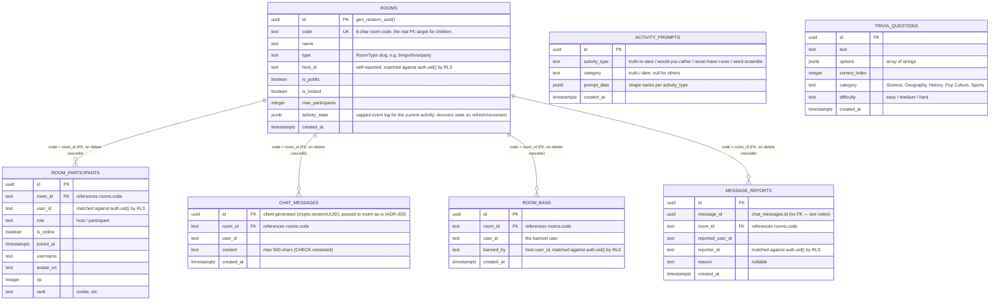

# ARCHITECTURE.md — Spintra System Architecture
> This document explains **why** the project is built the way it is, not just what exists.
> Update this document whenever a new pattern, folder, or architectural decision is introduced.
> Last updated: 2026-07-04

---

## 1. Tech Stack

| Layer | Technology | Version | Why |
|---|---|---|---|
| Framework | Next.js (App Router) | 16.2.9 | RSC for static pages, Client Components for realtime room; file-based routing |
| Language | TypeScript | ^5 | Strict type safety across the entire codebase |
| UI | React | 19.2.4 | Latest concurrent features; concurrent rendering helps with realtime updates |
| Realtime | Supabase Realtime | ^2.108.2 | Broadcast channels for game events; presence for participant tracking |
| Database | Supabase (PostgreSQL) | ^2.108.2 | Row Level Security, anonymous auth, real-time subscriptions |
| Styling | Tailwind CSS | ^4 | Utility-first; custom `glass` and `glass-card` classes in globals.css |
| Animation | Framer Motion | ^12.40.0 | `AnimatePresence`, `motion.div`, `useAnimation` for game transitions |
| 3D | Three.js + React Three Fiber | ^0.184 / ^9.6 | Physics-based lucky wheel rendering |
| Confetti | canvas-confetti | ^1.9.4 | Win celebrations; wrapped in `src/components/celebration.tsx` |
| QR Codes | qrcode | ^1.5 | Client-side room-invite QR generation in `room-header.tsx`, dynamically imported — replaced a third-party API call that sent every viewed room's URL (including private/locked ones) to an external service |
| UI Components | shadcn/ui (Radix-based) | various | Accessible primitives: Button, Dialog, Sheet, Badge, Input, ScrollArea, Tooltip, Avatar |
| Icons | lucide-react | ^1.21.0 | Consistent icon set |
| State (global) | Zustand | ^5.0.14 | Installed; not yet used in room. Available for future game state if needed. |
| E2E Tests | Playwright | ^1.40.0 | Smoke tests; config in `playwright.config.ts` |

---

## 2. Complete Folder Structure

```
spintra/
├── docs/
│   ├── START_HERE.md               ← Onboarding entry point — read this first
│   ├── INDEX.md                    ← Task-oriented doc routing guide
│   ├── AI_RULES.md                 ← Mandatory engineering constitution for every AI assistant
│   ├── AI_CONTEXT.md               ← Current project state only (update every session)
│   ├── HANDOFF.md                  ← Session continuity (last/current/next task, blockers)
│   ├── TASKS.md                    ← Backlog: High/Medium/Low priority, in progress, completed
│   ├── ARCHITECTURE.md             ← This file
│   ├── DECISIONS.md                ← Architecture Decision Records (ADRs)
│   ├── CHANGELOG_AI.md             ← Full chronological AI work log (append only)
│   ├── ENGINEERING_GOVERNANCE_REVIEW.md     ← Point-in-time audit, dated 2026-07-03 (historical)
│   ├── ENGINEERING_GOVERNANCE_REVIEW_V2.md  ← Current point-in-time audit, dated 2026-07-04
│   ├── ZUSTAND_INVESTIGATION.md    ← Zustand vs. Context state investigation report
│   ├── HOST_MIGRATION_AUDIT.md     ← Host-migration investigation report (all 14 games + infra)
│   ├── SPINTRA_CITY_SPEC.md        ← "Spintra City" engineering spec — START HERE for that feature
│   ├── SPINTRA_CITY_DESIGN.md      ← "Spintra City" feature: decisions, research, build plan
│   └── SPINTRA_CITY_CONTENT.md     ← "Spintra City" board content (spaces, economy, card decks)
├── src/
│   ├── app/
│   │   ├── globals.css             ← Global styles + glass/glass-card utilities
│   │   ├── layout.tsx              ← Root layout (ThemeProvider, Toaster)
│   │   ├── page.tsx                ← Home page
│   │   ├── create/                 ← Room creation flow
│   │   ├── explore/                ← Room discovery
│   │   ├── legal/
│   │   │   ├── terms/page.tsx      ← Terms of Service (static RSC)
│   │   │   └── privacy/page.tsx    ← Privacy Policy (static RSC)
│   │   ├── room/
│   │   │   ├── page.tsx            ← Room list page
│   │   │   └── [code]/
│   │   │       ├── page.tsx        ← Server component; passes `code` prop
│   │   │       ├── room-client.tsx ← Main client orchestrator (shell only — delegates to hooks/components)
│   │   │       ├── context/
│   │   │       │   └── room-activity-context.tsx  ← Shared context for activities
│   │   │       ├── hooks/
│   │   │       │   ├── use-room-chat.ts          ← Hook for chat, pagination, and text submissions
│   │   │       │   └── use-room-subscription.ts  ← Hook for Supabase Realtime, presence, and demo syncs
│   │   │       ├── components/
│   │   │       │   ├── room-header.tsx           ← Header details, connection status, lock/sound toggles
│   │   │       │   ├── room-sidebar.tsx          ← Chat box, reactions list, participant rows, and kick actions
│   │   │       │   └── close-room-dialog.tsx     ← Confirmation dialog for host closing the room
│   │   │       └── activities/
│   │   │           ├── activity-registry.ts       ← Plugin registry (game slug → dynamic import)
│   │   │           ├── activity-picker-dialog.tsx ← Host UI to switch games
│   │   │           ├── idle-screen.tsx            ← No-game state (single-game rooms)
│   │   │           ├── aggregate-idle-screen.tsx  ← No-game state (party rooms)
│   │   │           └── *-activity.tsx (×14)       ← One file per game, all migrated to the
│   │   │                                             zero-prop context-driven pattern (§3)
│   │   └── tools/
│   │       ├── bingo/              ← Standalone (non-room) tool page
│   │       ├── coin-flip/
│   │       ├── dice/
│   │       ├── guess-number/
│   │       ├── lucky-wheel/
│   │       ├── name-draw/
│   │       ├── never-have-i-ever/
│   │       ├── rps/
│   │       ├── team-maker/
│   │       ├── tournament/
│   │       ├── trivia/
│   │       ├── truth-or-dare/
│   │       ├── word-scramble/
│   │       └── would-you-rather/
│   ├── components/
│   │   ├── ui/                     ← shadcn/ui components (Button, Dialog, etc.)
│   │   ├── celebration.tsx         ← fireConfetti() wrapper
│   │   └── emoji.tsx               ← Emoji rendering, renderTextWithEmoji, EMOJI_UNICODE
│   └── lib/
│       ├── games.ts                ← GAMES array: GameDefinition[], 16 entries (14 real games + 2 create-only pseudo-types: party, classroom)
│       ├── types.ts                ← Shared TypeScript types (RoomType, ActivityEvent, User, etc.)
│       ├── utils.ts                ← cn(), shuffleArray<T>()
│       ├── room-user.ts            ← getOrCreateRoomUser(), getLocalRoomCreatorId()
│       ├── blocked-users.ts        ← localStorage-based per-viewer message block/mute
│       ├── chat-filter.ts          ← Basic profanity/spam content filter (client-side)
│       ├── audio.ts                ← Sound effects
│       └── supabase/
│           └── client.ts           ← getSupabaseBrowserClient() — returns null if no .env.local
├── supabase/
│   └── migrations/                 ← See §4's "Migrations Applied" table for the full,
│                                      current list (that table is the one docs:check
│                                      validates against the real files — this tree
│                                      intentionally doesn't duplicate it, since a
│                                      second hand-maintained list would drift silently)
├── tests/                          ← Playwright E2E tests
└── public/                         ← Static assets
```

---

## 3. Frontend Architecture

### Page Types
- **Static pages** (RSC by default): `/`, `/explore`, `/create`, `/legal/terms`, `/legal/privacy`, all `/tools/*` — these are server-rendered
- **Dynamic page** (fully client): `/room/[code]` — everything is client-side due to Supabase Realtime WebSocket

### Cookie/Consent Banner
`src/components/cookie-consent-banner.tsx` is a client component mounted globally inside `Providers` (`src/components/providers.tsx`), so it appears on every route. It shows once (gated on the `spintra-cookie-consent` localStorage key, following the `spintra-` key prefix convention in `room-user.ts`) and links to `/legal/privacy`. Uses the `queueMicrotask(() => setState(...))` pattern from `room-client.tsx`'s `hasMounted` effect to satisfy the `react-hooks/set-state-in-effect` lint rule.

### The Room Client Pattern

`room-client.tsx` serves as the clean client orchestrator. It has been modularized to separate state synchronization, user actions, and presentation elements into custom hooks and components:
- **Hooks:**
  - [useRoomSubscription](file:///c:/Users/tejas/Desktop/Spintra-1/src/app/room/[code]/hooks/use-room-subscription.ts): Isolated logic for Supabase Realtime channel lifecycle, Postgres changes subscriptions, presence states, and BroadcastChannel fallback event synchronization.
  - [useRoomChat](file:///c:/Users/tejas/Desktop/Spintra-1/src/app/room/[code]/hooks/use-room-chat.ts): Isolated logic for chat messages history loading, older messages pagination, and sending text or emoji responses.
- **Components:**
  - [RoomHeader](file:///c:/Users/tejas/Desktop/Spintra-1/src/app/room/[code]/components/room-header.tsx): Modular header element showing room title, badges, codes, active activity badges, and action buttons (copy link, locking, sounds toggles).
  - [RoomSidebar](file:///c:/Users/tejas/Desktop/Spintra-1/src/app/room/[code]/components/room-sidebar.tsx): Modular sidebar rendering the two-tabbed pane for Chat (messages container, reactions) and People list (participants, hosts crown, remove buttons).
  - [CloseRoomDialog](file:///c:/Users/tejas/Desktop/Spintra-1/src/app/room/[code]/components/close-room-dialog.tsx): Host-only modal dialog to confirm closing the room for everyone.
- **Does NOT own game state** — each activity owns its own local `useState`; migration to this pattern is complete for all 14 games.

### Activity Isolation Pattern

Each activity is a **self-contained plugin** following this contract:
```
1. Named export: export function XxxActivity()
2. Zero props
3. Reads shared state via: useRoomActivity()
4. Reads participants via: useRoomParticipants() [only if needed]
5. Owns all its game-specific state with local useState
6. Subscribes to events via: registerEventListener()
7. Sends events via: sendActivityEvent()
8. Cleans up: the return value of registerEventListener is returned from useEffect
9. Handles "activity_reset" event to clear its state
```

### Context Architecture

```
RoomActivityContext (STABLE — never re-renders subscribers)
├── roomCode: string
├── roomType: RoomType
├── isHost: boolean
├── hostUserId: string | null
├── currentUser: User
├── soundEnabled: boolean
├── sendActivityEvent: (event: ActivityEvent) => void
├── registerEventListener: (fn) => () => void
├── flushActivityState: () => Promise<void>
└── awardScore: (activityType, questionId?, choiceIndex?) => Promise<void>

RoomParticipantsContext (DYNAMIC — re-renders when participants list changes)
└── participants: RoomParticipant[]
```

**Why two contexts?** A single context triggers re-renders for all consumers when any value changes. Participants list changes frequently (joins/leaves). By isolating it in its own context, the 11 activities that don't need participants never re-render for that reason.

### Plugin Registry Pattern

```ts
// src/app/room/[code]/activities/activity-registry.ts
export const ACTIVITY_REGISTRY: Record<string, ComponentType> = {
  "coin-flip": dynamic(() => import("...").then(m => m.CoinFlipActivity), { ssr: false }),
  // ... 13 more
};
```

The registry is the **only** place that couples game types to components. `room-client.tsx` renders:
```tsx
const ActiveGame = ACTIVITY_REGISTRY[activeActivity.type];
<ActiveGame key={activeActivity.type} />
```

`key` forces remount on activity change, resetting all local game state cleanly.

### Pub/Sub Event Bus

Inside `room-client.tsx`:
```ts
// Publishers call:
sendActivityEvent({ kind: "coin_flip", result: "Heads" })
// → broadcasts to Supabase channel OR BroadcastChannel

// When events arrive from network:
handleActivityEvent(payload)
// → fans out to all listenersRef subscribers

// Activities subscribe:
useEffect(() => registerEventListener((event) => {
  if (event.kind === "coin_flip") { /* update local state */ }
}), [registerEventListener]);
// ← cleanup (deregister) is called automatically on unmount
```

**Since Session 41:** `registerEventListener` replays this activity's full persisted event log (`rooms.activity_state`, capped at 200 entries) to any listener the moment it registers — this is what lets a refresh/reconnect recover in-progress state (see §4's migration `0023`). A direct consequence: **an activity's listener-registration `useEffect` must keep a stable dependency array** — `[registerEventListener]`, optionally plus genuinely-stable values like `soundEnabled`/`currentUser.id` (every activity except one follows this). If a dependency changes as a *result* of handling a replayed event (e.g. a derived `useCallback` whose own deps include a state value the event handler sets), re-registering re-triggers the replay, which can re-fire that same terminal event and recreate the same state change — an infinite loop. This actually happened: Lucky Wheel's registration effect depended on `drawWheel`, a `useCallback` depending on `wheelSpinning` — every spin-start/spin-end transition changed `drawWheel`'s identity, re-registered the listener, replayed the still-present `wheel_spinning` event, and restarted the spin forever. Fixed by reading `wheelEntries`/`drawWheel` via refs inside the listener instead of depending on them for re-registration (`src/app/room/[code]/activities/lucky-wheel-activity.tsx`). Any new activity needing data that changes over the session should do the same — read a ref inside the callback, don't add it to the effect's dependency array.

---

## 4. Backend Architecture

### Supabase
- **No custom server** — all backend is Supabase (BaaS)
- **Database:** PostgreSQL with RLS on all tables
- **Auth:** Anonymous sign-in (`auth.signInAnonymously()`). Each browser session gets a unique UUID.
- **Realtime:** Broadcast + Presence channel per room (`room:{code}`), created with `{ config: { private: true } }` — authorized via RLS policies on `realtime.messages` (migration 0036), scoped by `is_member_of_room()`. **Sequencing requirement:** Realtime Authorization is evaluated once at `channel.subscribe()` time and cached for the connection's lifetime, so a client must not subscribe until its own `room_participants` row already exists — `use-room-subscription.ts` gates the subscribe effect on a `participantRowReady` flag set only after the participant upsert (`trackSelf`) completes, to avoid a client being denied and staying denied for the rest of its session. `postgres_changes` subscriptions on the same channel object (`chat_messages`/`room_participants`/`rooms` changes) are unaffected — that mechanism is governed entirely by table-level RLS, not `realtime.messages`.
- **Storage:** Not used

### Room Identification
- Rooms are identified by a 6-character `code` string (e.g. `3NJUZL`)
- The `code` is the primary key of the `rooms` table (not a UUID)
- `room_participants.room_id` references `rooms.code` (text FK)

### RLS Summary
- Users can only read/write their own data
- Hosts can update any participant row in their room (migration 0007)
- Hosts can update room metadata for their own rooms
- All inserts verified against `auth.uid()`
- Room creation and chat messages are additionally rate-limited by before-insert triggers keyed on `auth.uid()` (migration 0011) — 8 rooms / 10 min, 20 messages / 10 sec
- Kicking a participant (host-only) also records a `room_bans` row; a before-insert trigger on `room_participants` rejects any rejoin attempt from a banned `user_id` (migration 0012)
- Any participant can flag a chat message via `message_reports` (insert-only — no select policy; reviewed by the project owner directly via the Supabase SQL editor, since there's no admin backend)

### Migrations Applied
| # | File | Purpose |
|---|---|---|
| 0001 | `init_schema_and_rls` | Base schema (`rooms`, `room_participants`, `chat_messages`) + initial RLS |
| 0002 | `room_close_cascade` | Cascade-delete participants/messages when a room closes |
| 0003 | `disable_rls_for_realtime_delete` | Disabled RLS on `rooms`/`room_participants` to fix two realtime-delete bugs (see file header) |
| 0004 | `add_foreign_keys_and_composite_indexes` | Real FK constraints (`room_id` → `rooms.code`, cascade), composite indexes for chat/participant queries |
| 0005 | `enable_anonymous_auth_rls` | Re-enabled RLS, scoped to `auth.uid()` now that anonymous auth exists |
| 0006 | `allow_host_promotion_update` | Lets a participant self-promote to host if the current host is offline/left |
| 0007 | `allow_host_update_participants` | Lets the host update other participants' rows (e.g. marking a crashed client offline) |
| 0008 | `create_activity_prompts` | Creates + seeds `activity_prompts` (Truth or Dare / Would You Rather / Never Have I Ever) |
| 0009 | `backend_and_db_improvements` | Security definer membership helper, hardened RLS policies, check limits trigger, and cleanup function |
| 0010 | `create_trivia_and_scramble_prompts` | Creates `trivia_questions` table, seeds trivia questions, and seeds Word Scramble words |
| 0011 | `rate_limiting` | Before-insert triggers capping room creation (8 / 10 min per `host_id`) and chat messages (20 / 10 sec per `user_id`); supporting composite indexes |
| 0012 | `moderation_controls` | `room_bans` table + before-insert trigger blocking a banned `user_id` from rejoining a room (kick now also bans); `message_reports` table (insert-only, no select policy — reviewed via Supabase SQL editor) |
| 0013 | `room_bans_self_select` | Adds a self-scoped select policy to `room_bans` (`user_id = auth.uid()::text`) so a client can check whether *it* is banned before the room UI mounts, instead of only finding out via the before-insert trigger's error after the fact |
| 0014 | `tighten_rls_column_restrictions` | BEFORE UPDATE triggers restricting the `rooms` host-promotion escape hatch (0006) and the `room_participants` host-update policy (0007) to only the single column each was meant for |
| 0015 | `enforce_room_lock_at_db_level` | Before-insert triggers on `room_participants` and `chat_messages` blocking new joins/messages from anyone but the host while `rooms.is_locked` — previously client-side only |
| 0016 | `add_missing_constraints_and_index` | `rooms.max_participants > 0` check, `message_reports.message_id` FK to `chat_messages`, `trivia_questions.correct_index` bounds check, index on `activity_prompts.activity_type` |
| 0017 | `drop_unused_rooms_settings_column` | Drops `rooms.settings` (always `{}`, never read anywhere) |
| 0018 | `message_reports_host_visibility` | Adds `reviewed` flag + a select/update policy scoped to the room's host (column-restricted to `reviewed` only, via trigger) so reports are actually visible in the app |
| 0019 | `presence_reconciliation_any_participant` | Lets any participant flip another's `is_online` true→false (never true, never other columns) — previously only the host could, which meant a crashed host's own stale row could never be corrected by anyone, permanently blocking host succession |
| 0020 | `schedule_room_cleanup_cron` | Enables `pg_cron` and schedules `public.cleanup_inactive_rooms()` (defined in 0009) to run every 30 minutes, closing the gap where that function existed but was never actually scheduled |
| 0021 | `drop_unused_spectator_role` | Tightens `room_participants_role_check` to `('host', 'participant')` — `'spectator'` was dead at the DB level since the client-side `UserRole.spectator` enum was removed in Session 38 |
| 0022 | `add_public_rooms_index` | Partial index on `rooms (is_public, created_at desc) where is_public = true`, supporting the Explore page's actual query pattern as room count grows |
| 0023 | `add_room_activity_state` | Adds `rooms.activity_state jsonb` — a capped, ordered log of the current activity's events, letting a refreshing/reconnecting client replay and recover in-progress game state instead of starting blank |
| 0024 | `fix_participants_update_recursion` | Fixes a live "infinite recursion detected in policy for relation room_participants" 500 error — migration 0019's `participants_update` policy directly self-referenced `room_participants` instead of using the safe `is_member_of_room()` security-definer helper; this broke every reconnect, presence sync, and host-election update until fixed |
| 0025 | `room_join_rate_limit` | Before-insert rate-limit trigger on `room_participants` (20 joins / 10 min per `user_id`) — closes the gap where new room joins were the only major write path with no throttling, which could otherwise be used to game Explore's participant-count-based Trending/Popular ranking |
| 0026 | `fix_capacity_check_online_only` | Fixes `check_room_limit_before_join()` to count only `is_online = true` participants — a disconnected participant's row is kept, not deleted, so counting every row regardless of status made a room's effective capacity shrink permanently every time someone joined and left. Client-side capacity pre-checks (home page, explore page, navbar quick-join, room-client.tsx) fixed the same way in the same session |
| 0027 | `fix_host_promotion_trigger_stale_settings_column` | Fixes a live "record \"new\" has no field \"settings\"" error on every self-promotion host election — migration 0014's `restrict_host_promotion_update()` trigger compared `new.settings`/`old.settings`, but migration 0017 (which ran after) dropped `rooms.settings` entirely and never updated this function. Recreated with the stale column comparison removed |
| 0028 | `guess_number_server_side_secret` | Moves Guess-the-Number's secret and win-check server-side: new `guess_number_secrets` table with no direct SELECT/INSERT/UPDATE policies at all, and two SECURITY DEFINER RPCs (`set_guess_number_secret`, host-only; `check_guess_number`, room-members-only, returns just the hint) — fixes the secret being broadcast in plaintext to every client and each guesser's own client self-reporting an unverified "hint" |
| 0029 | `fix_room_join_toctou_race` | Closes a TOCTOU race in `check_room_limit_before_join()`: under READ COMMITTED, two concurrent joins to the same room could each see room for the last slot before either committed, letting a room exceed `max_participants`. Adds `pg_advisory_xact_lock(hashtextextended(new.room_id, 0))` at the top of the trigger, serializing joins racing on the *same* room (different rooms remain fully concurrent). Verified live: 10 concurrent join attempts for a room's single remaining slot — exactly 1 succeeded, 9 correctly rejected |
| 0030 | `message_report_rate_limit` | Before-insert rate-limit trigger on `message_reports` (10 reports / 10 min per `reporter_id`, same pattern as 0011/0025) — the pre-existing `unique (message_id, reporter_id)` constraint only stopped re-reporting the same message, not rapid-fire reporting many different messages. Verified live: 11 reports of 11 distinct messages, exactly 10 succeeded |
| 0031 | `grant_table_privileges` | Explicit `GRANT SELECT/INSERT/UPDATE/DELETE ... TO anon, authenticated` (plus matching `ALTER DEFAULT PRIVILEGES` for future tables) on every `public` schema table. Found via CI: a freshly-reset local/CI instance running only this repo's migrations rejected every write with "permission denied for table rooms" (42501) — the live hosted project has never hit this because Supabase's platform applies these grants automatically when a project is created via the dashboard, outside of and never captured in this repo's migration history. RLS remains the actual security boundary; this only lets Postgres evaluate those policies at all |
| 0032 | `moderation_event_observability` | Adds `log_moderation_event()`, called from all 5 rate-limit/ban-rejection triggers (room creation, chat, room joins, message reports, banned-rejoin) right before their `raise exception`. Uses `raise log` (Postgres server log, searchable via Supabase Dashboard → Logs → Postgres Logs, filter `MODERATION_EVENT`) rather than a table write — a table-based first attempt at this was verified live to log **zero rows, ever**, because `raise exception` rolls back the entire transaction, including a table INSERT made moments earlier in the same trigger; `raise log` is not a data change and survives exactly that rollback. Caught and corrected before ever being committed |
| 0033 | `guess_number_rate_limit` | Adds a call-frequency limit to `check_guess_number` (15 guesses / 60 sec per room+user, via a new `guess_number_attempts` table) — migration 0028 moved the secret server-side but didn't rate-limit the RPC itself, letting a scripted client binary-search the 1-100 secret in ~7 rapid calls. Verified live: exactly 15 guesses succeeded, the 16th was rejected |
| 0034 | `bound_text_column_lengths` | Adds `char_length()` CHECK constraints to previously-unbounded text columns: `rooms.name` (≤200), `room_participants.username`/`avatar_url` (≤100/≤2048), `message_reports.reason` (≤500) — generously above the client's own input limits, so no existing data was affected |
| 0035 | `activity_state_participant_only` | Moves `activity_state` from the world-readable `rooms` table into a new `room_activity_state` table with participant-scoped RLS (only room participants can SELECT/INSERT/UPDATE). In-progress game data (trivia answers, confessions, votes, etc.) was previously readable by any authenticated user via the existing `rooms for select using (true)` policy. |
| 0036 | `realtime_broadcast_presence_authorization` | Enables Supabase Realtime Authorization (RLS on `realtime.messages`) for the `room:{code}` Broadcast/Presence channel, scoped by the existing `is_member_of_room()` helper. Closes a gap where Broadcast/Presence had no authorization at all — any anonymous session could subscribe to any room's channel (including private rooms) with no trace, and a banned/kicked user kept full realtime access since the ban trigger only blocked `room_participants` inserts, never the channel. See §4's Realtime section for the client-side sequencing requirement this introduces. |
| 0037 | `message_reports_consistency_check` | Tightens `message_reports`' insert policy to also require room membership (`is_member_of_room()`) and that `message_id`/`room_id`/`reported_user_id` are mutually consistent with the real `chat_messages` row — previously a crafted client could file a syntactically valid report against a real message but falsely attribute it to an arbitrary `reported_user_id`, surfacing as if legitimate in the host-facing reports panel. |
| 0038 | `room_participants_update_rate_limit` | Adds a before-update rate limit on `room_participants` (30 updates / 60s per acting `auth.uid()` per room, new `room_participants_update_attempts` table) — the one major write path with no throttling; a client could otherwise spam `.update({ username })` on its own row at unlimited frequency, flooding every subscriber's realtime feed. Scoped generously so reconnects, host-election, and presence-reconciliation writes are unaffected. |
| 0039 | `bound_remaining_columns_and_activity_state_size` | Adds three previously-missing bounds: `room_activity_state.activity_state` server-side size CHECK (<100KB, the 200-event cap was client-side only), `rooms.code` length CHECK (1–12 chars, despite being the FK target for 5 other tables), and `rooms.type` enum CHECK (the 16 known `RoomType` values — client-validated only before this). |
| 0040 | `chat_messages_username_snapshot` | Adds a nullable `username` column to `chat_messages`, captured at send time (with a best-effort backfill against `room_participants` for existing rows) — previously any chat message from someone other than the current viewer always displayed as "Guest", even mid-session, since nothing captured or fetched a username at all. |
| 0041 | `analytics_events` | First-party analytics event log (`room_created`, `room_joined`, `activity_started` only — no third-party tool, matching the cookie banner's promise). Insert-only RLS (`actor_id = auth.uid()`), no select policy (internal data, not shown to any user), rate-limited (100 events/10min per actor, same pattern as migration 0038). |
| 0042 | `capacity_check_excludes_own_row` | Fixes `check_room_limit_before_join()` (0009/0026/0029) to exclude the joining user's own row from the online-participant count — the `before insert` trigger previously fired on every upsert attempt including one resolving to an update of the caller's own existing row, so a redundant/duplicate join upsert for an already-online user could see the room "at capacity" (counting themselves) and reject its own harmless upsert. Found live via React Strict Mode's dev-only double-effect-invocation reproducing it reliably; the same flaw could also misfire in production on a fast-reconnect race. A genuinely new participant is still correctly blocked once the room is truly full. |
| 0043 | `room_bans_unban_support` | Adds a host-scoped select policy (0013 only let a user see their *own* ban row, never the room's list) and a host-scoped delete policy (none existed) to `room_bans`, a nullable `username` snapshot column (captured at insert time, best-effort backfilled), and adds `room_bans` to the `supabase_realtime` publication (it was never added, unlike `message_reports` in 0018 — found live: the new unban panel's `postgres_changes` subscription silently never fired a single event without this). Closes the Session 45-deferred "no unban path" gap. |
| 0044 | `denormalize_participant_count` | Adds `participant_count` column to the `rooms` table, kept in sync via triggers on `room_participants` INSERT/UPDATE/DELETE. Optimizes the Explore page queries and completely removes the need for table-wide wildcard subscriptions. |
| 0045 | `secure_trivia_answers` | Revokes SELECT privileges on `trivia_questions(correct_index)` from standard roles (`anon`, `authenticated`), and adds secure backend RPC `verify_trivia_answer()` to check answers without exposing the key in queries. |
| 0046 | `atomic_host_election` | Creates database RPC `elect_room_host()` to update both the participant role and the room host reference in a single atomic database transaction, preventing client-side split-brain states. |
| 0047 | `fingerprint_and_ip_bans` | Adds `fingerprint_hash` column to `room_participants` and `room_bans`. The ban-check trigger now blocks rejoins matching either `user_id` or `fingerprint_hash`, preventing anonymous token rotation from bypassing bans. The client supplies `fingerprint_hash` directly on ban insert (kick deletes the participant row first, so a trigger-side lookup alone can't find it); the before-insert trigger on `room_bans` only falls back to its own lookup if the client didn't already provide one. |
| 0048 | `bingo_card_schema` | Adds `bingo_card` jsonb column to `room_participants` so clients can persist their generated Bingo card grids to the database, enabling host-side verification of win claims against the called numbers. |
| 0049 | `room_max_participants_bounds` | Replaces `rooms.max_participants > 0` (0016) with a full `2 ≤ max_participants ≤ 50` CHECK, making the DB the single authoritative source for the capacity ceiling that the creation slider, the new Room Settings Panel (ADR-007), and any raw API call all inherit — previously the 50 ceiling was enforced only in the browser, so a crafted request could set any positive value. Clamps any pre-existing out-of-range rows into `[2, 50]` before adding the constraint. |
| 0050 | `room_scores_and_xp_awards` | Adds `room_scores` (an append-only, participant-readable ledger; host-only reset delete; added to the realtime publication) and the `award_score()` SECURITY DEFINER RPC (ADR-008/009) — server-verifies each win/participation claim by reading persisted state directly (never a client-supplied claim), for Trivia (re-checks `trivia_questions.correct_index`), RPS (re-derives the round's winner from persisted `rps_choice` events), and Bingo (re-checks the caller's persisted `bingo_card` against persisted `bingo_call` events, then fans out participation credit to other online participants). Idempotent via a unique constraint on `(room_id, user_id, activity_type, round_key, award_kind)`, where `round_key` is always RPC-derived (never client-supplied) from event-log position. Atomically writes `room_participants.xp`/`rank` in the same transaction via `tier_for_xp()` (mirrors `lib/xp.ts`'s `tierOf()`). Also adds a session-local bypass flag to `check_room_participants_update_rate_limit()` (0038) and `restrict_host_participant_update()` (0014) so this RPC's server-verified writes — including crediting *other* participants' XP for Bingo's fan-out — aren't blocked by the client-abuse protections those triggers exist for. |
| 0051 | `fix_participant_restriction_regression` | Fixes a security regression introduced by migration 0050: `restrict_host_participant_update()` (0050's copy) was written from an outdated version of the function, silently dropping the host/non-host distinction and true→false-only direction check that migration 0019 added — live in production between 0050 and 0051, any participant could flip any other participant's `is_online` in either direction, not just the host, and not just in the safe direction. Found in code review (PR #20) before merge; restores 0019's exact behavior with 0050's server-verified-write bypass flag layered on top of it, not in place of it. |
| 0052 | `award_score_review_fixes` | Code-review fixes for migration 0050's `award_score()` (PR #20, none security-critical — the one that was, is 0051): folds the trivia question's sequence number into `round_key` so a legitimately re-drawn question (shuffle-bag exhaustion) doesn't collide with its earlier occurrence and silently earn nothing; extracts the insert-with-conflict + XP-update pattern (previously copy-pasted 4×) into an internal `_record_award()` helper, explicitly `revoke`d from `public` (Postgres grants EXECUTE to PUBLIC by default on function creation — an unrevoked helper would have been directly callable by any client, bypassing every verification `award_score` performs, confirmed live during this migration's own testing); reuses `is_member_of_room()` in `room_scores`' SELECT policy instead of a hand-rolled duplicate; combines the RPS/Bingo branches' two redundant event-log scans into one; corrects a comment that inaccurately implied `elect_room_host` (0046) uses an equivalent bypass mechanism (it doesn't — 0050 is the first place this pattern appears). Drops and recreates `award_score` with a new `p_question_num` parameter (a true signature change, not just `create or replace`, to avoid leaving a stale 4-parameter overload live). |
| 0053 | `moderation_actions` | Adds `moderation_actions` (ADR-010) — an append-only audit log for the Moderation Dashboard's History tab, written at the 3 host-action call sites (dismiss report, kick+ban, unban). Host-scoped SELECT and INSERT RLS (matching `message_reports_select_host`/`room_bans_select_host`'s exact pattern) — simpler than `award_score` (0050), since a host's own moderation action doesn't need adversarial server-side re-verification the way a participant's self-reported game win does. Added to the `supabase_realtime` publication in this same migration (the repeated lesson from 0043 and 0050/0051: never assume, always verify). |
| 0054 | `message_reports_reporter_username` | Adds a nullable `reporter_username` snapshot column to `message_reports`, captured client-side at report time (same pattern as `chat_messages.username`, migration 0040), so the Moderation Dashboard's Reports tab can render "X reported a message from Y" without a live join — the reported side is already recoverable via the existing `chat_messages(username)` embed. Best-effort backfilled from `room_participants` for pre-existing rows. |
| 0055 | `moderation_rpc` | Replaces the client-orchestrated multi-step moderation flows with three transactional `SECURITY DEFINER` functions — `moderation_kick_ban`, `moderation_unban`, `moderation_dismiss_report` — each of which re-verifies the caller is the room's *current* host and (for kick) rejects self-targeting, then performs every step of the verb atomically (kick & ban: snapshot → participant delete → ban insert-or-noop → close all open reports about the target → audit-log row). Motivated by three real bugs from the client-side version in one week: an RLS-rejected `room_bans` upsert, reports outliving a kick, and a promoted host able to kick & ban themself from a stale report. Table RLS policies are unchanged; execute is granted to `authenticated` only. Client callers live in `src/lib/moderation.ts`. |
| 0056 | `elect_room_host_demotes_stale_host` | `elect_room_host` (0046) promoted the new host but left the dead host's `room_participants` row at `role='host'`, producing a permanent second "Host" entry in the People list and — if the ex-host ever rejoined — a stale online `role='host'` row that blocked every future election. Now the election demotes every other `role='host'` row in the room in the same transaction. The demotion is a cross-row role change that `trg_restrict_host_participant_update` (0014) forbids (triggers still fire for `SECURITY DEFINER` functions even though RLS doesn't), so the trigger gains a transaction-local `app.electing_room_host` GUC escape hatch set only inside `elect_room_host` — the same pattern `award_score`'s `app.bypass_participant_rate_limit` established (0050/0052). Client counterpart (same session, no migration): a one-shot settle pass ~10s after subscribing reconciles the DB's `is_online=true` rows against live presence, fixing rooms whose host crashed *before* the joiner arrived — the presence-sync handler could only ever catch peers who crash while being watched, so such rooms were stuck at "Waiting for host…" forever. |
| 0057 | `guess_number_get_secret` | Adds `get_guess_number_secret`, letting a host recover the secret number after a refresh — critically, after a host migration (see `docs/HOST_MIGRATION_AUDIT.md` finding C1), since the secret otherwise only ever lived in the *original* host's local React state and a newly-promoted host had no way to see it. **Host-migration audit correction (2026-07-14):** this migration's own SQL had a dollar-quoting bug (`as $body` / `$body;` instead of `$body$` / `$body$;`) that made every prior apply attempt fail with a syntax error — it was tracked as applied while never actually running, confirmed live via `pg_proc`. Fixed and re-applied; verified end-to-end with a real host session (returns the secret) and a real non-host session (rejected). |
| 0058 | `fix_host_trigger_regression` | Restores `restrict_host_participant_update`'s host/participant branching logic (0051) that 0056 had accidentally overwritten while adding its own bypass — confirmed genuinely live via `pg_proc`. |
| 0059 | `tournament_fixes` | Widens the `room_activity_state` size check from 100KB to 500KB so a 50-player Round Robin (1,225 matches) doesn't exceed it. **Host-migration audit correction (2026-07-14):** the original SQL targeted `public.rooms.activity_state`, a column migration 0035 had already dropped 24 migrations earlier (moved to `public.room_activity_state`) — it failed with "column does not exist" on every apply attempt and was tracked as applied while never running. Retargeted to the correct table; verified live by upserting a 309KB payload (would have failed the old 100KB cap on the correct table, succeeds under the new 500KB one). |
| 0060 | `tournament_state_host_only` | Closes `docs/HOST_MIGRATION_AUDIT.md` finding H1: unlike RPS/Bingo/Trivia, Tournament's scoring has no server-verified backstop (`award_score`) — any room member could persist a forged `tournament_update` (declare themselves champion, corrupt the bracket) via `room_activity_state`'s deliberately open write policy (0035). Adds a `before insert or update` trigger that requires the live `auth.uid() = rooms.host_id` specifically when the persisted payload's `type = 'tournament'` — every other activity type, and clearing state entirely (switching games), is untouched. Narrow by design (inspects only the JSON `type` discriminator, doesn't modify any other function), unlike this session's earlier 0056 regression. Paired with a client-side check in `tournament-activity.tsx` (a self-reported `senderId` on `tournament_update` events, checked against each client's own live-synced host id) that dampens the live-broadcast race during an actual transition — not a security boundary itself (a client could lie about `senderId`), that's this trigger's job. Verified live: non-host forged write rejected, legitimate host write succeeds, non-tournament activity writes and state-clearing remain open to any participant as before. |
| 0061 | `elect_room_host_idempotent` | Found via a live two-participant repro: the promoted client saw "You are now the host." three times, and the other client's screen showed a *different* user as host entirely. Two bugs in `elect_room_host` (0046/0056): (1) no idempotency guard — once a caller was already host, the "is there another online host" check found none and fell through to redundantly re-run the promotion, returning `true` again every time (5 separate client call sites in `use-room-subscription.ts` can each independently trigger this in the same tick, each re-firing the toast/notification/broadcast); (2) no concurrency control — two clients calling it for the same room at nearly the same moment could interleave (both read "no online host" before either commits, both promote themselves, neither's demote step touches the other), producing a genuine split-brain with two `role='host'` rows and `rooms.host_id` landing on whichever committed last. Fixed with a transaction-scoped `pg_advisory_xact_lock(hashtext(p_room_code))` acquired first (serializes concurrent callers for the same room — a second caller blocks until the first commits, then correctly no-ops via the new "already host" check) plus the idempotency check itself. Verified live via `pg_proc`. |
| 0062 | `rooms_select_privacy_fix` | Found while investigating the Explore page's public-room display: `rooms_select` (0005) has been `using (true)` since anonymous auth was introduced and was never tightened when `room_participants`/`chat_messages` were hardened in 0009 (that migration's own follow-up comment, carried into 0035, explicitly notes this was still true and left unaddressed). Any anon-key holder — the key ships in every page load, not a secret — could list every room ever created via a direct REST call, private ones included: `code`, `name`, `type`, `host_id`, `is_locked`. Since a room's `code` is the actual join credential ("Off = invite-only via code" per the create-room UI), this fully defeated privacy for any private, unlocked room — no invite needed, codes were directly enumerable. Fixed in two parts: (1) tightened `rooms_select` to the same `is_public OR host OR is_member_of_room` pattern 0009 already established; (2) RLS decides row visibility from the requester's identity alone, so it can't distinguish "already knew this exact code" from "enumerated every row" — a policy tight enough to stop enumeration would also block a legitimate invited friend from looking up the one room they have a real code for. Added `get_room_by_code(p_code text)`, a `security definer` RPC matching the existing `is_member_of_room`/`elect_room_host` pattern: takes exactly one code, returns at most one row (code is `unique`), so enumeration stays impossible through it. All 6 client call sites that look up a room by code pre-membership (join-check, room-page entry, create-room's collision check, host-migration/kicked-vs-closed check) now go through this RPC via a new `src/lib/room-lookup.ts` helper instead of a raw `.from("rooms").select()`. Verified against a local Docker Supabase reset before ever touching production: reproduced the exposure locally first (confirmed empty after the fix, including against a freshly-minted real anonymous session, not just an unauthenticated API-key request); confirmed a genuine room member still sees their room via a normal `SELECT` once actually joined; full Playwright suite (63/63) green against the local instance, covering create+join, two-participant join, reconnect, host-kick, and live settings sync. |

**Current status:** all 62 applied; RLS enabled on all 13 `public` schema tables (`rooms`, `room_participants`, `chat_messages`, `activity_prompts`, `trivia_questions`, `room_bans`, `message_reports`, `guess_number_secrets`, `guess_number_attempts`, `room_activity_state`, `analytics_events`, `room_scores`, `moderation_actions`) plus `realtime.messages`; latest migration is `0062_rooms_select_privacy_fix`. Note: 0008 and 0010 were re-applied in Session 37, and 0009 in Session 40, after discovering their tracked "applied" status didn't match reality (see `CHANGELOG_AI.md` Session 37/40) — the migration numbering itself didn't change, only their actual execution against the live database.

### APIs / Integration Points
No custom REST or GraphQL API exists for app functionality — every client talks directly to Supabase (or, unconfigured, the `BroadcastChannel` Web API). The one exception is a health check. The full set of integration points:
- **Supabase Realtime — broadcast channel** (`room:{code}`, private/authorized since migration 0036): activity events (game state) and activity-type switching
- **Supabase Realtime — presence channel** (same private channel): participant online/offline tracking
- **Supabase DB** (`@supabase/supabase-js`): `rooms`, `room_participants`, `chat_messages`, `activity_prompts` — see §12 for the full ER diagram
- **`BroadcastChannel`** (Web API): same-browser-tab fallback for all of the above when Supabase env vars are absent
- **`GET /api/health`** (`src/app/api/health/route.ts`): a stable, machine-readable liveness contract for external uptime monitors / a hosting platform's health check / deploy pipeline — found missing entirely in the Session 41 audit (no way to detect a silent outage). `force-dynamic`, never cached. Returns `200 {"status":"ok","database":"reachable"}` after a real (cheapest-possible, zero-row) query against `rooms`; `503 {"status":"error","database":"unreachable"|"not_configured"}` if the query fails or env vars are missing.

---

## 5. Authentication Flow

```
1. Page loads → room-client.tsx mounts
2. getSupabaseBrowserClient() called
   a. If Supabase configured → supabase.auth.getSession()
      - If session exists → use it
      - If no session → supabase.auth.signInAnonymously()
   b. If NOT configured → null returned → BroadcastChannel fallback mode
3. currentUser state updated with Supabase user ID
4. Room participant row created/updated in `room_participants` — this single
   row carries both membership (role, is_online, joined_at) and profile
   fields (username, avatar_url, xp, rank). There is no separate `users`
   table (see §12 ER Diagram) — profile data is per-room-membership, not
   global across rooms.
```

### Local Dev Without Supabase
The app functions fully without Supabase using the `BroadcastChannel` Web API. All game events and participant updates are synced across tabs in the same browser. This is the "offline" / demo mode.

---

## 6. State Management

| State Type | Where | How |
|---|---|---|
| Room metadata | `room-client.tsx` `useState` | Fetched from DB, cached locally |
| Participants | `room-client.tsx` `useState` | Realtime subscription |
| Chat messages | `room-client.tsx` `useState` | Realtime subscription + optimistic echo |
| Active game type | `room-client.tsx` `useState` | Broadcast channel (host pushes to all) |
| Game-specific state | **Each activity's own** `useState` | Local, reset on `activity_reset` — `room-client.tsx` holds none of it |

### No Zustand in Rooms (By Design)
Zustand is installed but not used for room state. The Pub/Sub + local state pattern is sufficient and avoids coupling activities to a global store. If game state ever needs to persist across activity switches, Zustand would be the appropriate next step.

---

## 7. Design Patterns

### 1. Strangler Fig
Used for incremental migration of the monolithic `room-client.tsx`. Build new infrastructure alongside old; replace piece by piece; delete legacy last. App remains functional at every step.

### 2. Plugin Registry
`activity-registry.ts` is the single registration point. Adding a game = 1 file + 1 registry line. The host (`room-client.tsx`) is completely decoupled from game implementations.

### 3. Pub/Sub Event Bus
`registerEventListener` / `sendActivityEvent` decouple the Supabase transport layer from individual game logic. Activities are pure subscribers and publishers; they don't know about WebSockets.

### 4. Stable Context Separation
Two contexts: stable (never changes) + dynamic (participants). Prevents cascade re-renders when participants join/leave. Recommended by the React team for high-frequency update scenarios.

### 5. Error Isolation
`room-client.tsx` defines a class-based `ErrorBoundary` (React requires class components for `componentDidCatch`) that wraps the active game, keyed by `activeActivity.type` — the same key the `ACTIVITY_REGISTRY` render uses. If any single activity throws during render, only that activity's viewport is replaced with a fallback; the room shell (chat, participants, header) keeps working. This is why a crashing game can never take down the whole room.

---

## 8. Coding Standards

### TypeScript
- Strict mode enabled
- No `as any` without an explanatory comment
- Discriminated unions preferred over string literal checks with type coercion
- Prefer `type` over `interface` for union types; prefer `interface` for object shapes

### React
- All client components: `"use client"` as first line
- All named exports (no default exports for activities)
- `useCallback` for functions passed to context or as event listeners
- `useMemo` for context value objects
- `useRef` for mutable values that don't need re-renders (channel refs, flag refs)

### Naming Conventions
| Entity | Convention | Example |
|---|---|---|
| React components | PascalCase | `CoinFlipActivity` |
| File names | kebab-case | `coin-flip-activity.tsx` |
| Event kinds | snake_case | `coin_flip`, `activity_reset` |
| Game type slugs (in URL/DB) | kebab-case | `coin-flip`, `team-maker` |
| Custom hooks | `use` prefix + camelCase | `useRoomActivity` |
| Database tables | snake_case | `room_participants` |
| Database columns | snake_case | `host_id`, `is_online` |
| CSS utility classes | lowercase hyphen | `glass-card` |

### File Organisation
- Co-locate feature code: activities live in `activities/`, context in `context/`
- Shared utilities in `src/lib/` — keep them pure (no React imports in utils)
- UI components in `src/components/ui/` (shadcn pattern)

---

## 9. Build Pipeline

```bash
npm run dev        # next dev — starts local dev server at localhost:3000
npm run build      # next build — production build, runs typecheck + lint
npm run start      # next start — starts production server locally
npm run typecheck  # tsc --noEmit — TypeScript only
npm run lint       # eslint — linting only
npm run docs:check # scripts/check-docs-drift.mjs — docs/ vs. real filesystem
npm run verify     # typecheck + lint + docs:check — full local quality gate
npm run test:smoke # npx playwright test — E2E smoke tests
npm run ci         # verify + npm audit + build + test:smoke — mirrors the CI pipeline locally
npm run verify:migration [name] # queries the LIVE linked Supabase project to confirm a
                    # migration's functions/triggers/policies/tables/indexes/extensions/
                    # columns actually exist — not just that `supabase migration list`
                    # marks it "applied". Defaults to the newest migration file if no
                    # name/number is given. Run this after every `supabase db push` —
                    # see the note below.
```

**Mandatory after every `supabase db push --linked --yes`:** run `npm run verify:migration` (or `npm run verify:migration <number>` for an older one) immediately afterward. Three migrations (`0008`, `0009`, `0010`) were each independently tracked "applied" while never having actually executed live, only caught by manual, ad-hoc cross-checking each time (see `docs/CHANGELOG_AI.md` Sessions 37/38/40) — this script (`scripts/verify-migration.mjs`) makes that check automatic and repeatable instead of tribal knowledge a future session has to remember to do by hand.

**Node requirement:** >=20.9.0 (see `package.json` engines field)

**CI (`.github/workflows/ci.yml`) has two jobs:**
1. `validate` — typecheck, lint, docs:check, `npm audit`, production build, Playwright smoke tests. Runs the app **without** Supabase configured (no secrets in CI), so it exercises the demo-mode `BroadcastChannel` fallback, not real RLS/triggers/realtime. Its build/test steps set `SKIP_ENV_VALIDATION=true` to opt out of `next.config.ts`'s build-time env var check — that check exists to fail-fast on an *accidentally* misconfigured production build, but this job's missing vars are intentional, so it needs an explicit opt-out rather than tripping the same guard. (This conflict silently broke `validate` on every commit from `752295f` through `5ddd24c` until caught and fixed post-push — see `docs/CHANGELOG_AI.md`.)
2. `db-integration` (added Session 41) — spins up an ephemeral, local Supabase stack via the Supabase CLI (`supabase start`, Docker-based, no secrets, never touches the live project), applies every migration fresh with `supabase db reset` (exactly the check that would have caught migration `0010`'s SQL syntax bug at PR time instead of it silently never running in production), then builds and runs the same Playwright suite **against that real instance** — so `tests/multiplayer-loop.spec.ts` actually exercises real anonymous auth, real RLS policies, and real triggers end-to-end, not just the demo-mode fallback.

---

## 10. Deployment

**Status as of Session 61: live in production at https://spintra.io.** Hosted on Vercel, connected directly to this GitHub repo (auto-deploys on push to `main`). Custom domain `spintra.io` connected via Cloudflare DNS (CNAME record to Vercel, DNS-only/unproxied — Cloudflare's proxy conflicts with Vercel's own SSL/routing if left on); the default `spintra-xi.vercel.app` alias `308`-redirects to `spintra.io` as the one canonical URL, not served as a second live address. `NEXT_PUBLIC_SUPABASE_URL`/`NEXT_PUBLIC_SUPABASE_ANON_KEY`/`NEXT_PUBLIC_SENTRY_DSN` are all set in Vercel's project environment variables (Production + Preview). Verified end-to-end post-deploy: `/api/health` reachable with `database`/`auth`/`realtime` all green, a real room created successfully via a live test against production Supabase, zero console/network errors.

One non-obvious setting worth knowing about if a future deploy ever seems unreachable: Vercel projects can have **"Vercel Authentication"** (Project → Settings → Deployment Protection) enabled, which gates *all* traffic — including the production URL — behind a Vercel login wall. This was on by default when the project was first created and had to be explicitly disabled; the symptom was a `302` redirect to `vercel.com/sso-api` instead of the app. If a deployment is ever unexpectedly unreachable, check this setting before assuming a build or DNS problem.

Because `NEXT_PUBLIC_SUPABASE_URL`/`NEXT_PUBLIC_SUPABASE_ANON_KEY` are inlined into the client bundle at **build time** (not read at runtime), a production build that ever runs without these two vars set would silently fall back every visitor to the same-browser-tab-only `BroadcastChannel` mode instead of real multiplayer, with no error — caught by `ProductionConfigWarningBanner` (`src/components/production-config-warning-banner.tsx`, mounted in `Providers`), which renders an unmissable red banner if this ever happens. Not currently triggering; keep it that way by re-checking Vercel's env vars are set whenever `.env.example` gains a new required key.

**Deployment checklist history (kept for context, not a live TODO — all items below are done):**
1. ~~Choose a host~~ — Vercel, Session 61.
2. ~~Set env vars before first production build~~ — done, Session 61; confirmed the warning banner does not appear on the live site.
3. ~~Confirm real-time sync works across two different devices/networks~~ — confirmed via Session 61's live multi-client stress testing (separate real browser contexts/anonymous identities, not just tabs in one browser).
4. ~~Decide on and enable GitHub branch protection for `main`~~ — done, Session 42 (see below).
5. ~~Configure CD for DB migrations~~ — `deploy.yml` auto-pushes `supabase/migrations/**` changes to the live project on merge to `main`; had zero repo secrets configured and had silently failed since creation until fixed and verified in Session 61 (see `docs/CHANGELOG_AI.md`).

GitHub branch protection: confirmed via the GitHub API that `main` had zero protection (404 "Branch not protected"), then enabled it: `validate` and `db-integration` must both pass before merging (`strict: true`, so the branch must be up to date with `main` first), force-pushes and branch deletion blocked. No PR-review requirement and `enforce_admins: false` — deliberately low-friction for a solo repo, not the strictest possible policy.

### Supabase CLI (linked, as of 2026-07-04)
`supabase/config.toml` exists and the project is linked to the live Supabase project (ref `qjxaehxwuqntyqrdmihs`) via `supabase link`. New migrations can be pushed directly with `npx supabase db push --linked --yes` instead of manually pasting SQL into the Dashboard SQL Editor. Requires a one-time `supabase login` (browser OAuth) per machine — not something an AI assistant can do headlessly.

### Realtime Connection Ceiling
**Flagged in the Session 41 audit as undocumented — a real scaling constraint with no visibility anywhere in this codebase.** Every participant who has a room open holds one live Supabase Realtime WebSocket connection (`use-room-subscription.ts`'s `channel(\`room:${roomCode}\`)`), subscribed to a presence channel plus several `postgres_changes` filters (`chat_messages`, `room_participants` INSERT/UPDATE/DELETE, `rooms` UPDATE). Supabase's concurrent Realtime connection limit is set by the project's plan tier and is **not something this codebase can see or enforce** — once it's hit, new connections start failing or queuing, which would look like "the app stopped syncing" with no error message pointing at the actual cause. This document deliberately does not hardcode a specific number: Supabase's plan tiers, names, and included limits change over time, and a stale number here would be actively misleading. **Before any launch or marketing push expected to drive concurrent traffic, check the current limit and live usage in the Supabase Dashboard → Settings → Usage (or Billing).** If the limit is a real risk, the immediate lever is a plan upgrade — there's no code-level mitigation for a hard platform ceiling like this one.

### Backup & Disaster Recovery
**Configured and verified working as of Session 61** — `.github/workflows/db-backup.yml` runs `pg_dump` daily (03:00 UTC, plus manual `workflow_dispatch`) and uploads a gzip-compressed dump to a Cloudflare R2 bucket (`spintra-db-backups`; chosen over AWS S3 for its free tier and zero egress fees). Getting to a genuinely working backup took 4 rounds of fixes in Session 61 — see `docs/CHANGELOG_AI.md`'s Session 61 entry for the full sequence (missing secrets, a Postgres server/client version mismatch, a missing apt repository, and apt-installing a version without it becoming the one actually invoked). The workflow also enforces a 2KB minimum-size sanity check on the resulting archive before upload, and runs with `set -euo pipefail` so a `pg_dump` failure actually fails the job — GitHub Actions bash steps default to `-e` only, and the silent-empty-backup failure mode above only became visible once this was added.

Every delete in the schema is still a hard, cascading delete (no table has a `deleted_at`/soft-delete column); the one closest thing to an "admin" workflow — reviewing `message_reports` — happens by hand in the Supabase SQL editor (`ARCHITECTURE.md` §4's RLS Summary), which is a real fat-finger risk with no undo, mitigated but not eliminated by the daily backup now existing. Point-in-time recovery (finer-grained than a daily snapshot) still depends on the Supabase project's plan tier and has not been separately confirmed — check Supabase Dashboard → Settings → Backups if PITR specifically becomes a requirement.

### Runbook — "Something's wrong, where do I look first?"
**Found missing in the Session 45 audit** — the pieces already existed (health check, Realtime ceiling note, backup note above), just scattered with no single starting point. In rough order:
1. **`GET /api/health`** — is the database reachable at all? A `503` means env vars are missing or the DB is unreachable; start there before anything else.
2. **Supabase Dashboard → Logs → Postgres Logs**, filter `MODERATION_EVENT` — every rate-limit/ban rejection is logged here (migration `0032`); a spike suggests abuse, not a bug.
3. **Supabase Dashboard → Settings → Usage/Billing** — check the Realtime concurrent-connection count against the plan's limit (see above) if users report "stopped syncing" with no error.
4. **`npx supabase migration list --linked`** vs. `docs/ARCHITECTURE.md` §4 — confirm the live project's applied migrations match what's documented; this repo has hit "tracked applied but never actually ran" three separate times (Sessions 37/38/40), so don't assume the tracking table is accurate without `npm run verify:migration`.
5. **GitHub Actions** (`.github/workflows/ci.yml`) — check the most recent run on `main` for a regression that slipped through, especially around any DB migration or Realtime-touching change.
6. **This doc's "Known Issues" section in `AI_CONTEXT.md`** — rule out an already-documented, accepted trade-off before treating something as a new bug.

---

## 11. Important Implementation Details

### `hasMounted` Pattern
```ts
const [hasMounted, setHasMounted] = useState(false);
useEffect(() => { setHasMounted(true); }, []);
const isHost = hasMounted && (roomHostId ? ... : ...);
```
**Why:** `isHost` depends on `localStorage` (via `getLocalRoomCreatorId`). Reading localStorage during SSR would cause a hydration mismatch. Gating behind `hasMounted` ensures the value is only computed client-side.

### `getSupabaseBrowserClient()` Returns Null
If `.env.local` does not contain `NEXT_PUBLIC_SUPABASE_URL` and `NEXT_PUBLIC_SUPABASE_ANON_KEY`, this function returns `null`. The codebase is designed to handle `null` gracefully — all Supabase calls are preceded by `if (!supabase) { /* use BroadcastChannel */ }`.

### `shuffleArray<T>` in utils.ts
Fisher-Yates unbiased shuffle. Use this everywhere a random shuffle is needed. Never use `array.sort(() => Math.random() - 0.5)`.

### `fireConfetti()` in celebration.tsx
Call this on any game win. It uses `canvas-confetti` with a burst configuration. No parameters needed.

---

## 12. Database ER Diagram

Generated directly from the 12 migration files in `supabase/migrations/` (not from `AI_CONTEXT.md`'s prior "Database Status" table, which incorrectly listed a `users` table that does not exist — corrected 2026-07-04).



**Notes:**
- `ACTIVITY_PROMPTS` and `TRIVIA_QUESTIONS` have no foreign keys to `rooms` — they are global, room-independent lookup tables read by any client (see RLS select policies).
- `MESSAGE_REPORTS.message_id` has no FK to `chat_messages.id` — the app has no message-delete feature, so a message can only disappear via room cascade-delete, which already cleans up `message_reports` via the `room_id` FK. A second FK would be redundant.
- `ROOM_BANS` and `MESSAGE_REPORTS` have no `select` RLS policy — clients can only insert. Bans are checked internally by a `security definer` trigger; reports are reviewed by the project owner directly via the Supabase SQL editor (there is no admin backend).
- `rooms.id` is the literal primary key, but every foreign key and every client-side query filters on `rooms.code` instead (a 6-character human-shareable string) — `id` mostly goes unused outside its role as the PK.
- `room_participants` and `chat_messages` both have `replica identity full` set (migration 0001/0002) so that Postgres logical replication — which Supabase Realtime reads from — includes the full old row on UPDATE/DELETE, not just PK columns. Without this, realtime DELETE events for a kicked participant or a closed room would be silently dropped for subscribers filtering on non-PK columns like `room_id`/`code`.
