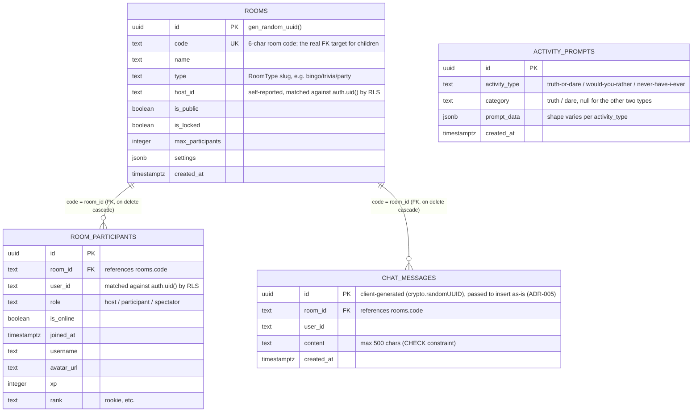

# ARCHITECTURE.md — Spintra System Architecture
> This document explains **why** the project is built the way it is, not just what exists.
> Update this document whenever a new pattern, folder, or architectural decision is introduced.
> Last updated: 2026-07-04

---

## 1. Tech Stack

| Layer | Technology | Version | Why |
|---|---|---|---|
| Framework | Next.js (App Router) | 16.2.9 | RSC for static pages, Client Components for realtime room; file-based routing |
| Language | TypeScript | ^5 | Strict type safety across the entire codebase |
| UI | React | 19.2.4 | Latest concurrent features; concurrent rendering helps with realtime updates |
| Realtime | Supabase Realtime | ^2.108.2 | Broadcast channels for game events; presence for participant tracking |
| Database | Supabase (PostgreSQL) | ^2.108.2 | Row Level Security, anonymous auth, real-time subscriptions |
| Styling | Tailwind CSS | ^4 | Utility-first; custom `glass` and `glass-card` classes in globals.css |
| Animation | Framer Motion | ^12.40.0 | `AnimatePresence`, `motion.div`, `useAnimation` for game transitions |
| 3D | Three.js + React Three Fiber | ^0.184 / ^9.6 | Physics-based lucky wheel rendering |
| Confetti | canvas-confetti | ^1.9.4 | Win celebrations; wrapped in `src/components/celebration.tsx` |
| UI Components | shadcn/ui (Radix-based) | various | Accessible primitives: Button, Dialog, Sheet, Badge, Input, ScrollArea, Tooltip, Avatar |
| Icons | lucide-react | ^1.21.0 | Consistent icon set |
| State (global) | Zustand | ^5.0.14 | Installed; not yet used in room. Available for future game state if needed. |
| E2E Tests | Playwright | ^1.40.0 | Smoke tests; config in `playwright.config.ts` |

---

## 2. Complete Folder Structure

```
spintra/
├── docs/
│   ├── START_HERE.md               ← Onboarding entry point — read this first
│   ├── INDEX.md                    ← Task-oriented doc routing guide
│   ├── AI_RULES.md                 ← Mandatory engineering constitution for every AI assistant
│   ├── AI_CONTEXT.md               ← Current project state only (update every session)
│   ├── HANDOFF.md                  ← Session continuity (last/current/next task, blockers)
│   ├── TASKS.md                    ← Backlog: High/Medium/Low priority, in progress, completed
│   ├── ARCHITECTURE.md             ← This file
│   ├── DECISIONS.md                ← Architecture Decision Records (ADRs)
│   ├── CHANGELOG_AI.md             ← Full chronological AI work log (append only)
│   ├── ENGINEERING_GOVERNANCE_REVIEW.md     ← Point-in-time audit, dated 2026-07-03 (historical)
│   └── ENGINEERING_GOVERNANCE_REVIEW_V2.md  ← Current point-in-time audit, dated 2026-07-04
├── src/
│   ├── app/
│   │   ├── globals.css             ← Global styles + glass/glass-card utilities
│   │   ├── layout.tsx              ← Root layout (ThemeProvider, Toaster)
│   │   ├── page.tsx                ← Home page
│   │   ├── create/                 ← Room creation flow
│   │   ├── explore/                ← Room discovery
│   │   ├── room/
│   │   │   ├── page.tsx            ← Room list page
│   │   │   └── [code]/
│   │   │       ├── page.tsx        ← Server component; passes `code` prop
│   │   │       ├── room-client.tsx ← Main client orchestrator (shell only — owns no game state)
│   │   │       ├── context/
│   │   │       │   └── room-activity-context.tsx  ← Shared context for activities
│   │   │       └── activities/
│   │   │           ├── activity-registry.ts       ← Plugin registry (game slug → dynamic import)
│   │   │           ├── activity-picker-dialog.tsx ← Host UI to switch games
│   │   │           ├── idle-screen.tsx            ← No-game state (single-game rooms)
│   │   │           ├── aggregate-idle-screen.tsx  ← No-game state (party rooms)
│   │   │           └── *-activity.tsx (×14)       ← One file per game, all migrated to the
│   │   │                                             zero-prop context-driven pattern (§3)
│   │   └── tools/
│   │       ├── bingo/              ← Standalone (non-room) tool page
│   │       ├── coin-flip/
│   │       ├── dice/
│   │       ├── guess-number/
│   │       ├── lucky-wheel/
│   │       ├── name-draw/
│   │       ├── never-have-i-ever/
│   │       ├── rps/
│   │       ├── team-maker/
│   │       ├── tournament/
│   │       ├── trivia/
│   │       ├── truth-or-dare/
│   │       ├── word-scramble/
│   │       └── would-you-rather/
│   ├── components/
│   │   ├── ui/                     ← shadcn/ui components (Button, Dialog, etc.)
│   │   ├── celebration.tsx         ← fireConfetti() wrapper
│   │   └── emoji.tsx               ← Emoji rendering, renderTextWithEmoji, EMOJI_UNICODE
│   └── lib/
│       ├── games.ts                ← GAMES array: GameDefinition[] with metadata for all 14 games
│       ├── types.ts                ← Shared TypeScript types (RoomType, ActivityEvent, User, etc.)
│       ├── utils.ts                ← cn(), shuffleArray<T>()
│       ├── room-user.ts            ← getOrCreateRoomUser(), getLocalRoomCreatorId()
│       ├── audio.ts                ← Sound effects
│       └── supabase/
│           └── client.ts           ← getSupabaseBrowserClient() — returns null if no .env.local
├── supabase/
│   └── migrations/
│       ├── 0001_init_schema_and_rls.sql
│       ├── 0002_room_close_cascade.sql
│       ├── 0003_disable_rls_for_realtime_delete.sql
│       ├── 0004_add_foreign_keys_and_composite_indexes.sql
│       ├── 0005_enable_anonymous_auth_rls.sql
│       ├── 0006_allow_host_promotion_update.sql
│       ├── 0007_allow_host_update_participants.sql
│       ├── 0008_create_activity_prompts.sql
│       └── 0009_backend_and_db_improvements.sql      ← Latest migration
├── tests/                          ← Playwright E2E tests
└── public/                         ← Static assets
```

---

## 3. Frontend Architecture

### Page Types
- **Static pages** (RSC by default): `/`, `/explore`, `/create`, all `/tools/*` — these are server-rendered
- **Dynamic page** (fully client): `/room/[code]` — everything is client-side due to Supabase Realtime WebSocket

### The Room Client Pattern

`room-client.tsx` is the only truly monolithic client component. It is the orchestrator:
- Owns the Supabase Realtime channel lifecycle
- Owns the chat state and rendering
- Owns the participant list
- Owns room metadata (name, type, locked state)
- **Does NOT own game state** — each activity owns its own local `useState`; migration to this pattern is complete for all 14 games

### Activity Isolation Pattern

Each activity is a **self-contained plugin** following this contract:
```
1. Named export: export function XxxActivity()
2. Zero props
3. Reads shared state via: useRoomActivity()
4. Reads participants via: useRoomParticipants() [only if needed]
5. Owns all its game-specific state with local useState
6. Subscribes to events via: registerEventListener()
7. Sends events via: sendActivityEvent()
8. Cleans up: the return value of registerEventListener is returned from useEffect
9. Handles "activity_reset" event to clear its state
```

### Context Architecture

```
RoomActivityContext (STABLE — never re-renders subscribers)
├── roomCode: string
├── roomType: RoomType
├── isHost: boolean
├── currentUser: User
├── soundEnabled: boolean
├── sendActivityEvent: (event: ActivityEvent) => void
└── registerEventListener: (fn) => () => void

RoomParticipantsContext (DYNAMIC — re-renders when participants list changes)
└── participants: RoomParticipant[]
```

**Why two contexts?** A single context triggers re-renders for all consumers when any value changes. Participants list changes frequently (joins/leaves). By isolating it in its own context, the 11 activities that don't need participants never re-render for that reason.

### Plugin Registry Pattern

```ts
// src/app/room/[code]/activities/activity-registry.ts
export const ACTIVITY_REGISTRY: Record<string, ComponentType> = {
  "coin-flip": dynamic(() => import("...").then(m => m.CoinFlipActivity), { ssr: false }),
  // ... 13 more
};
```

The registry is the **only** place that couples game types to components. `room-client.tsx` renders:
```tsx
const ActiveGame = ACTIVITY_REGISTRY[activeActivity.type];
<ActiveGame key={activeActivity.type} />
```

`key` forces remount on activity change, resetting all local game state cleanly.

### Pub/Sub Event Bus

Inside `room-client.tsx`:
```ts
// Publishers call:
sendActivityEvent({ kind: "coin_flip", result: "Heads" })
// → broadcasts to Supabase channel OR BroadcastChannel

// When events arrive from network:
handleActivityEvent(payload)
// → fans out to all listenersRef subscribers

// Activities subscribe:
useEffect(() => registerEventListener((event) => {
  if (event.kind === "coin_flip") { /* update local state */ }
}), [registerEventListener]);
// ← cleanup (deregister) is called automatically on unmount
```

---

## 4. Backend Architecture

### Supabase
- **No custom server** — all backend is Supabase (BaaS)
- **Database:** PostgreSQL with RLS on all tables
- **Auth:** Anonymous sign-in (`auth.signInAnonymously()`). Each browser session gets a unique UUID.
- **Realtime:** Broadcast channels per room (not DB replication — avoids RLS complications with realtime)
- **Storage:** Not used

### Room Identification
- Rooms are identified by a 6-character `code` string (e.g. `3NJUZL`)
- The `code` is the primary key of the `rooms` table (not a UUID)
- `room_participants.room_id` references `rooms.code` (text FK)

### RLS Summary
- Users can only read/write their own data
- Hosts can update any participant row in their room (migration 0007)
- Hosts can update room metadata for their own rooms
- All inserts verified against `auth.uid()`

### Migrations Applied
| # | File | Purpose |
|---|---|---|
| 0001 | `init_schema_and_rls` | Base schema (`rooms`, `room_participants`, `chat_messages`) + initial RLS |
| 0002 | `room_close_cascade` | Cascade-delete participants/messages when a room closes |
| 0003 | `disable_rls_for_realtime_delete` | Disabled RLS on `rooms`/`room_participants` to fix two realtime-delete bugs (see file header) |
| 0004 | `add_foreign_keys_and_composite_indexes` | Real FK constraints (`room_id` → `rooms.code`, cascade), composite indexes for chat/participant queries |
| 0005 | `enable_anonymous_auth_rls` | Re-enabled RLS, scoped to `auth.uid()` now that anonymous auth exists |
| 0006 | `allow_host_promotion_update` | Lets a participant self-promote to host if the current host is offline/left |
| 0007 | `allow_host_update_participants` | Lets the host update other participants' rows (e.g. marking a crashed client offline) |
| 0008 | `create_activity_prompts` | Creates + seeds `activity_prompts` (Truth or Dare / Would You Rather / Never Have I Ever) |
| 0009 | `backend_and_db_improvements` | Security definer membership helper, hardened RLS policies, check limits trigger, and cleanup function |

**Current status:** all 9 applied; RLS enabled on all 4 tables; latest policy is `0009_backend_and_db_improvements`.

### APIs / Integration Points
No custom REST or GraphQL API exists — every client talks directly to Supabase (or, unconfigured, the `BroadcastChannel` Web API). The full set of integration points:
- **Supabase Realtime — broadcast channel** (`room_{code}`): activity events (game state) and activity-type switching
- **Supabase Realtime — presence channel**: participant online/offline tracking
- **Supabase DB** (`@supabase/supabase-js`): `rooms`, `room_participants`, `chat_messages`, `activity_prompts` — see §12 for the full ER diagram
- **`BroadcastChannel`** (Web API): same-browser-tab fallback for all of the above when Supabase env vars are absent

---

## 5. Authentication Flow

```
1. Page loads → room-client.tsx mounts
2. getSupabaseBrowserClient() called
   a. If Supabase configured → supabase.auth.getSession()
      - If session exists → use it
      - If no session → supabase.auth.signInAnonymously()
   b. If NOT configured → null returned → BroadcastChannel fallback mode
3. currentUser state updated with Supabase user ID
4. Room participant row created/updated in `room_participants` — this single
   row carries both membership (role, is_online, joined_at) and profile
   fields (username, avatar_url, xp, rank). There is no separate `users`
   table (see §12 ER Diagram) — profile data is per-room-membership, not
   global across rooms.
```

### Local Dev Without Supabase
The app functions fully without Supabase using the `BroadcastChannel` Web API. All game events and participant updates are synced across tabs in the same browser. This is the "offline" / demo mode.

---

## 6. State Management

| State Type | Where | How |
|---|---|---|
| Room metadata | `room-client.tsx` `useState` | Fetched from DB, cached locally |
| Participants | `room-client.tsx` `useState` | Realtime subscription |
| Chat messages | `room-client.tsx` `useState` | Realtime subscription + optimistic echo |
| Active game type | `room-client.tsx` `useState` | Broadcast channel (host pushes to all) |
| Game-specific state | **Each activity's own** `useState` | Local, reset on `activity_reset` — `room-client.tsx` holds none of it |

### No Zustand in Rooms (By Design)
Zustand is installed but not used for room state. The Pub/Sub + local state pattern is sufficient and avoids coupling activities to a global store. If game state ever needs to persist across activity switches, Zustand would be the appropriate next step.

---

## 7. Design Patterns

### 1. Strangler Fig
Used for incremental migration of the monolithic `room-client.tsx`. Build new infrastructure alongside old; replace piece by piece; delete legacy last. App remains functional at every step.

### 2. Plugin Registry
`activity-registry.ts` is the single registration point. Adding a game = 1 file + 1 registry line. The host (`room-client.tsx`) is completely decoupled from game implementations.

### 3. Pub/Sub Event Bus
`registerEventListener` / `sendActivityEvent` decouple the Supabase transport layer from individual game logic. Activities are pure subscribers and publishers; they don't know about WebSockets.

### 4. Stable Context Separation
Two contexts: stable (never changes) + dynamic (participants). Prevents cascade re-renders when participants join/leave. Recommended by the React team for high-frequency update scenarios.

### 5. Error Isolation
`room-client.tsx` defines a class-based `ErrorBoundary` (React requires class components for `componentDidCatch`) that wraps the active game, keyed by `activeActivity.type` — the same key the `ACTIVITY_REGISTRY` render uses. If any single activity throws during render, only that activity's viewport is replaced with a fallback; the room shell (chat, participants, header) keeps working. This is why a crashing game can never take down the whole room.

---

## 8. Coding Standards

### TypeScript
- Strict mode enabled
- No `as any` without an explanatory comment
- Discriminated unions preferred over string literal checks with type coercion
- Prefer `type` over `interface` for union types; prefer `interface` for object shapes

### React
- All client components: `"use client"` as first line
- All named exports (no default exports for activities)
- `useCallback` for functions passed to context or as event listeners
- `useMemo` for context value objects
- `useRef` for mutable values that don't need re-renders (channel refs, flag refs)

### Naming Conventions
| Entity | Convention | Example |
|---|---|---|
| React components | PascalCase | `CoinFlipActivity` |
| File names | kebab-case | `coin-flip-activity.tsx` |
| Event kinds | snake_case | `coin_flip`, `activity_reset` |
| Game type slugs (in URL/DB) | kebab-case | `coin-flip`, `team-maker` |
| Custom hooks | `use` prefix + camelCase | `useRoomActivity` |
| Database tables | snake_case | `room_participants` |
| Database columns | snake_case | `host_id`, `is_online` |
| CSS utility classes | lowercase hyphen | `glass-card` |

### File Organisation
- Co-locate feature code: activities live in `activities/`, context in `context/`
- Shared utilities in `src/lib/` — keep them pure (no React imports in utils)
- UI components in `src/components/ui/` (shadcn pattern)

---

## 9. Build Pipeline

```bash
npm run dev        # next dev — starts local dev server at localhost:3000
npm run build      # next build — production build, runs typecheck + lint
npm run start      # next start — starts production server locally
npm run typecheck  # tsc --noEmit — TypeScript only
npm run lint       # eslint — linting only
npm run docs:check # scripts/check-docs-drift.mjs — docs/ vs. real filesystem
npm run verify     # typecheck + lint + docs:check — full local quality gate
npm run test:smoke # npx playwright test — E2E smoke tests
npm run ci         # verify + build + test:smoke — mirrors the CI pipeline locally
```

**Node requirement:** >=20.9.0 (see `package.json` engines field)

---

## 10. Deployment

Not documented in this session. The project uses Supabase hosted (remote). Frontend deployment target is unknown — likely Vercel (Next.js default) based on project structure.

---

## 11. Important Implementation Details

### `hasMounted` Pattern
```ts
const [hasMounted, setHasMounted] = useState(false);
useEffect(() => { setHasMounted(true); }, []);
const isHost = hasMounted && (roomHostId ? ... : ...);
```
**Why:** `isHost` depends on `localStorage` (via `getLocalRoomCreatorId`). Reading localStorage during SSR would cause a hydration mismatch. Gating behind `hasMounted` ensures the value is only computed client-side.

### `getSupabaseBrowserClient()` Returns Null
If `.env.local` does not contain `NEXT_PUBLIC_SUPABASE_URL` and `NEXT_PUBLIC_SUPABASE_ANON_KEY`, this function returns `null`. The codebase is designed to handle `null` gracefully — all Supabase calls are preceded by `if (!supabase) { /* use BroadcastChannel */ }`.

### `shuffleArray<T>` in utils.ts
Fisher-Yates unbiased shuffle. Use this everywhere a random shuffle is needed. Never use `array.sort(() => Math.random() - 0.5)`.

### `fireConfetti()` in celebration.tsx
Call this on any game win. It uses `canvas-confetti` with a burst configuration. No parameters needed.

---

## 12. Database ER Diagram

Generated directly from the 9 migration files in `supabase/migrations/` (not from `AI_CONTEXT.md`'s prior "Database Status" table, which incorrectly listed a `users` table that does not exist — corrected 2026-07-04).



**Notes:**
- `ACTIVITY_PROMPTS` has no foreign key to `rooms` — it's a global, room-independent lookup table read by any client (see `activity_prompts_select_all` RLS policy).
- `rooms.id` is the literal primary key, but every foreign key and every client-side query filters on `rooms.code` instead (a 6-character human-shareable string) — `id` mostly goes unused outside its role as the PK.
- `room_participants` and `chat_messages` both have `replica identity full` set (migration 0001/0002) so that Postgres logical replication — which Supabase Realtime reads from — includes the full old row on UPDATE/DELETE, not just PK columns. Without this, realtime DELETE events for a kicked participant or a closed room would be silently dropped for subscribers filtering on non-PK columns like `room_id`/`code`.
