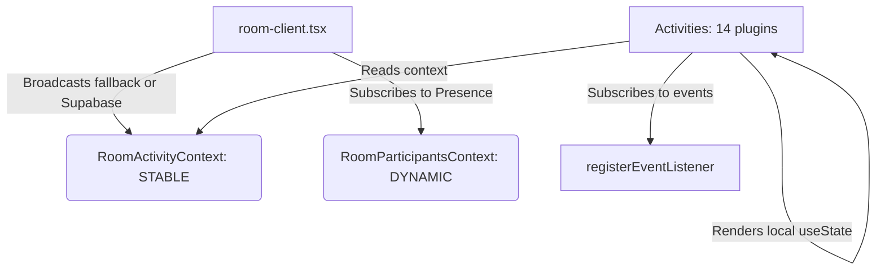

# Zustand State Management Investigation Report — Spintra

This document evaluates the feasibility, benefits, and implementation patterns of adopting **Zustand** for state management in the Spintra room application, specifically addressing game state persistence.

---

## 1. Current State Architecture

Spintra currently manages room state using a combination of **React Context Split** and a **Pub/Sub Event Bus**:



### Context Isolation Design
- **`RoomActivityContext`**: Holds static metadata and functions (`sendActivityEvent`, `registerEventListener`). Because these never change after mounting, subscribers never re-render.
- **`RoomParticipantsContext`**: Holds the dynamic list of participants. Re-renders only the components that read it when people join/leave.
- **Local State**: Each activity holds its own state inside React `useState` hooks. The client shell is completely decoupled from activity-specific state variables.

---

## 2. The Persistence Problem

Because the `room-client.tsx` orchestrator uses the registry plugin pattern:
```tsx
const ActiveGame = ACTIVITY_REGISTRY[activeActivity.type];
<ActiveGame key={activeActivity.type} />
```
Changing the active activity type alters the `key`, forcing a complete unmount of the previous activity component and mounting the new one. This triggers:
1. **Destruction of all local component state** (all `useState` variables in the unmounted activity are garbage-collected).
2. **Re-initialization on remount** (switching back to the game starts from clean default states).

While this is clean for transient games, it creates significant challenges for:
- **Visual Scoreboard**: Scores must accumulate across rounds and survive game switches.
- **Tournament Bracket Tree**: Matches, pairings, and progress must persist if the host toggles a setting or checks chat.
- **XP/Leveling**: Progress must be tracked reliably.

---

## 3. Zustand vs. React Context

| Aspect | React Context + Pub/Sub (Current) | Zustand |
|---|---|---|
| **Re-render Scope** | Manual context split needed to prevent cascade re-renders. | Direct selectors (`useStore(state => state.foo)`) limit re-renders out of the box. |
| **Lifecycle** | State lives in the UI component tree; dies on unmount. | Store lives in module memory; survives UI unmounting. |
| **Boilerplate** | Medium (Provider wrapper, React.createContext, hooks). | Extremely low (single `create` call). |
| **Coupling** | Decoupled; components are isolated plugins. | Tightly coupled if store holds all activity states globally. |

---

## 4. Proposed Zustand Store Pattern for Spintra

To implement Zustand without breaking Spintra's **zero-prop modular activity design** and fallback sandbox mode, we should follow a **Slice Pattern**:

### Store Structure (`src/lib/store/game-store.ts`)
```ts
import { create } from "zustand";

interface ScoreboardState {
  scores: Record<string, number>; // user_id -> score
  addPoints: (userId: string, points: number) => void;
  resetScores: () => void;
}

interface TriviaState {
  currentRound: number;
  incrementRound: () => void;
  resetTrivia: () => void;
}

type GameStore = ScoreboardState & TriviaState;

export const useGameStore = create<GameStore>((set) => ({
  // Scoreboard Slice
  scores: {},
  addPoints: (userId, points) =>
    set((state) => ({
      scores: { ...state.scores, [userId]: (state.scores[userId] || 0) + points },
    })),
  resetScores: () => set({ scores: {} }),

  // Trivia Slice
  currentRound: 1,
  incrementRound: () => set((state) => ({ currentRound: state.currentRound + 1 })),
  resetTrivia: () => set({ currentRound: 1 }),
}));
```

### Consumption inside an Activity
```tsx
import { useGameStore } from "@/lib/store/game-store";

export function ScoreboardComponent() {
  // Selector-based subscription: only re-renders when scores change
  const scores = useGameStore((state) => state.scores);

  return (
    <div>
      {Object.entries(scores).map(([userId, score]) => (
        <div key={userId}>{userId}: {score} points</div>
      ))}
    </div>
  );
}
```

---

## 5. Architectural Recommendation

1. **Keep the current Pub/Sub for transient games**: Do not migrate simple games (e.g. Coin Flip, Rock Paper Scissors) to Zustand. Their lifecycle is short, and React `useState` is simpler.
2. **Adopt Zustand for Scores & Leaderboards**: The upcoming **Visual Scoreboard** and **XP and Leveling System** are perfect candidates for Zustand. Storing participant scores and XP gains in a Zustand store keeps them persistent throughout the room session.
3. **Adopt Zustand for bracket trees**: Store the state of the tournament matches in a slice so that returning users or hosts toggling views don't wipe out tournament progression.
